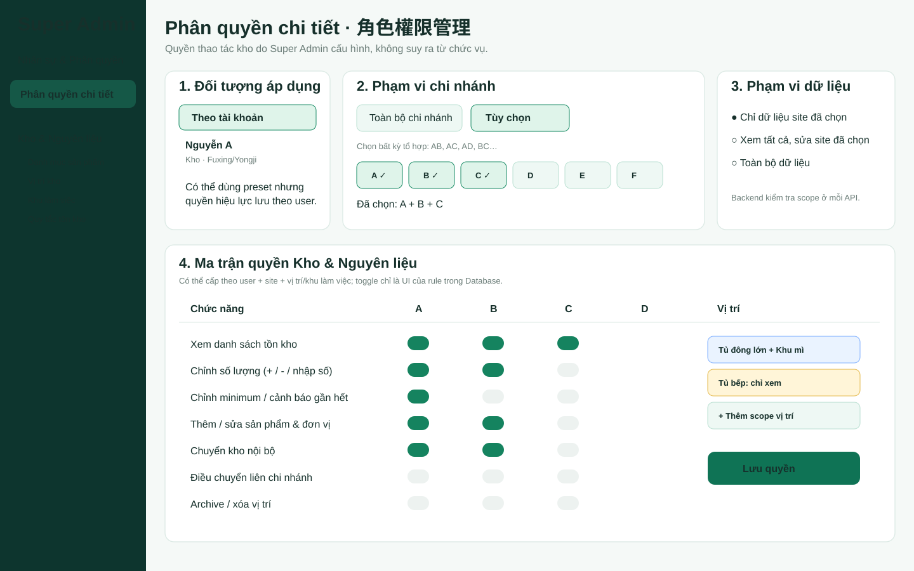
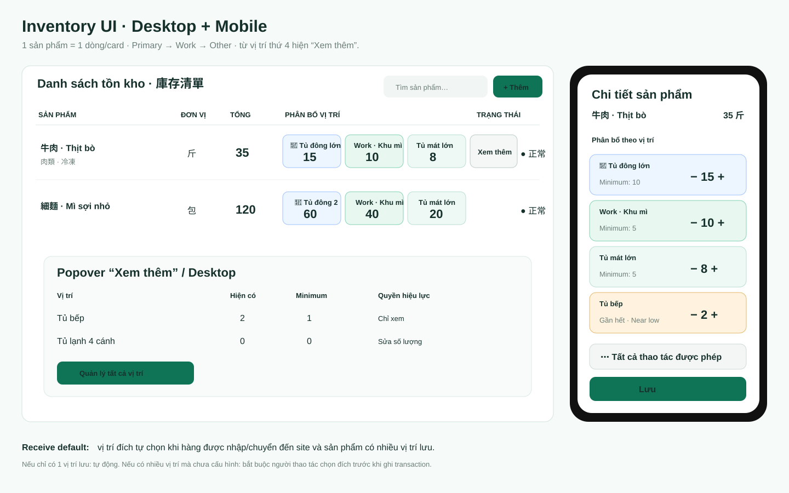

# Kitchen OS Work Log

## 2026-10-06 — PR #212 production closure

- Exact tested PR head: `d382084046b9451b31bef3b931e01d98d3e5727a`.
- PR gates PASS: Master Data/Admin #520, Super Admin Browser #448, Workforce Diagnostic #596, Deploy/full-device #1255.
- Merged as `b3a56ee83a0d5f00a9543f668cd95789eaa65ded`.
- Main Deploy Kitchen OS #1256 PASS.
- Backup: `/opt/kitchen-os/backups/kitchen_os_20261006T123406Z.dump`.
- Production: app/database/edge healthy, release `b3a56ee`, schema `032`, `DATA_INTEGRITY_OK`, production UI smoke PASS.
- Inventory Site Production Audit #566 PASS.
- Workforce Staff #807, Attendance #781, Schedule Backfill #791 and Schedule Parity #580 PASS.
- Approved Super Admin permission UI and Inventory multi-location UI are now production-verified.
- No Inventory quantity/schema/API/permission-semantic mutation was introduced.
- Closure sets `ACTIVE_PR: none`.

## 2026-10-06 — PR #212 Approved Super Admin + Inventory UI

- Started from production baseline `2dd48d7` / schema `032` after PR #211 Deploy #1250 and Inventory Audit #560 passed.
- Created fresh branch `style/super-admin-inventory-approved-ui-20261006` and PR #212.
- Super Admin UI: restyled the existing PostgreSQL-backed Inventory permission editor into the approved account target / arbitrary multi-site scope / action-matrix hierarchy; selected-site states, risk/action rows, advanced overrides and sticky save controls remain bound to the current save model.
- Inventory UI: added a final Maestro presentation layer for the existing product-centric multi-location renderer, including dark product rows/cards, Primary/Work/storage chips, state-specific Near/Low/Empty surfaces, capability-driven three-dot menu, and dark detail drawer.
- Tablet <=1100px uses product cards instead of the legacy wide row grid; Mobile detail remains full-screen with safe-area handling.
- No renderer rewrite, schema migration, stock mutation, API change, permission semantic change or business-data hard-code.
- Added static regression locks for the approved Super Admin permission layout and Inventory multi-location presentation.
- NEXT: run exact-head PR gates/full-device browser tests; merge only green exact head; deploy and run production Inventory audit.

## 2026-10-06 — PR #211 Inventory low-stock notification center

- Started after Inventory phase 2 production closure on verified release `09fbda4` / schema `032`.
- Confirmed remaining hard-code audit finding: `src/rules-core.js` still owns `PROCUREMENT_PRODUCTS` and `src/store-core.js` still owns mutable Procurement category/schedule defaults. These will be migrated in a separate PR after #211.
- Added a dedicated Inventory notification center driven by current PostgreSQL stock metadata:
  - Out of stock: quantity <= 0;
  - Low: minimum enabled / minimum > 0 and quantity <= minimum;
  - Near-low: warning enabled and quantity <= warning threshold after Low is excluded.
- Added all / empty / low / near filters.
- Added a prominent Inventory alert shortcut with current alert count.
- Alert rows show product, exact storage/Work location, current quantity, threshold and severity.
- Alert rows open the existing multi-location product detail so allowed users can resolve quantity using the same granular permission model.
- Added responsive Desktop/Mobile styling.
- Extended Inventory production contract and browser regression to certify alert tabs/filters and mobile fit.
- No schema/data mutation in PR #211; schema 032 already contains the required warning/minimum fields.
- Closure: merged as `2dd48d7828ea542e976170103c1132aea1f73d55`; Deploy #1250 PASS; Inventory Site Production Audit #560 PASS.
- Procurement DB migration remains deferred while the approved UI workstream is completed in PR #212.

## 2026-10-06 — Inventory phase 2 production closure: PR #207 + PR #208

- PR #207 exact head `034144568ddc71a252c439cb65cfb922cb25c2af` passed Deploy #1234, Master/Admin #510, Super Admin Browser #431, API Load #723 and Workforce Diagnostic #586.
- PR #207 merged as `5a7a37d9269aff13e45ff544d134c86bc8934475`.
- Main Deploy #1235 attempt 1 hit only a detached-close-button browser certification race after remote rerender; unchanged merge SHA rerun passed regression and deployed.
- Production UI smoke then revealed a stale test fixture that did not provide granular `/api/inventory/access` actions; runtime intentionally failed closed and hid operation tabs.
- PR #208 changed certification only, not runtime business behavior. Exact head `5f0506f7b4a2911ae0e91fc318caf5a8ebb8ffd7` passed Deploy #1243, Master/Admin #514, Super Admin Browser #438 and API Load #725.
- PR #208 merged as `09fbda4291f3f02d895ae84f2779df77bcaccf76`.
- Main Deploy #1244 / `37439101732`: PASS.
- Backup: `/opt/kitchen-os/backups/kitchen_os_20261006T090006Z.dump`.
- Health: app/database OK, schema `032`, release `09fbda4`; `DATA_INTEGRITY_OK`; production UI smoke PASS.
- AgentMemory seed/recall PASS.
- Post-deploy: Inventory Audit #554, Workforce Staff #795, Attendance #769, Schedule Backfill #779 and Schedule Parity #568 all PASS.
- Inventory multi-location UI, Mobile Full Screen Detail, permission-controlled quick quantity editing, DB Category/Unit/Primary/Receive Default integration and arbitrary site combinations are now production-verified.
- Closure sets `ACTIVE_PR: none`.
- Next Inventory runtime work should focus on low-stock notification UX and remaining mutable business-data hard-code audit. Handoff auto-polling/force-refresh and VPS disk cleanup remain separate.

## 2026-10-06 — PR #208 phase-2 production certification repair

- PR #207 exact head `034144568ddc71a252c439cb65cfb922cb25c2af` passed its PR gates and merged as `5a7a37d9269aff13e45ff544d134c86bc8934475`.
- Main Deploy #1235 attempt 1 failed in full-device certification only because a remote Inventory editor rerender detached the close button while Playwright was waiting for it to stabilize.
- Reran the unchanged merge SHA. Attempt 2 full regression PASS and deployment PASS.
- Production deploy evidence: backup `/opt/kitchen-os/backups/kitchen_os_20261006T075152Z.dump`; schema `032`; `DATA_INTEGRITY_OK`; app/database/edge healthy; release `5a7a37d`; AgentMemory sync/recall PASS.
- Production UI smoke then failed at the first branch operation tab because its API interceptor still returned `{}` for the phase-2 `/api/inventory/access?site=...` endpoint. This made the UI correctly fail closed and hide permission-driven controls.
- Opened PR #208 from current main to repair certification only.
- Added a granular Inventory access fixture to `tests/production-ui-smoke.mjs`.
- Stabilized cross-surface editor close by clicking the current DOM close control atomically after rerenders and still requiring modal detach.
- Added static guards so neither production certification fixture can silently regress.
- No runtime Inventory logic, database schema/data, permissions or UI behavior changed.

## 2026-10-06 — PR #207 Inventory multi-location UI phase 2

- Continued from the approved Inventory mockup/spec after PR #205 production closure.
- Existing branch `feat/inventory-multilocation-ui-20261006` was audited before opening PR #207; it was already ahead of main with the phase-2 implementation, so work continued from that branch rather than recreating or overwriting it.
- One product now renders as one row/card.
- Location priority is Primary -> Work -> Other.
- Latest user-approved display rule is **3+ configured locations => first 2 chips + Xem thêm / 查看更多**.
- Mobile location/product detail is a full-screen sheet.
- Mobile quick editing supports minus / direct number / plus only when the effective per-location permission allows it.
- Three-dot advanced actions are capability-driven.
- Frontend now caches the backend Inventory access snapshot per site, including per-location and per-Work-Area effective decisions.
- Site registry is permission-filtered from PostgreSQL; frontend no longer requires role/location assumptions to decide visible Inventory sites.
- Add/Edit Product integrates Category, Unit, Primary Location and Receive Default.
- Unit editors may type a new unit; catalog sync persists it in PostgreSQL.
- Read model now carries `unit_code`, `category_code`, minimum/warning metadata and item-location primary/display metadata.
- Receive Default remains separate from Primary and Work Location.
- PR #207 opened for exact-head regression certification.
- VPS disk optimization and Handoff polling remain deferred.

## 2026-10-06 — PR #205 production closure

- Exact tested head `df2abcab9680170a46622d44ff68e654f96d5619` passed Deploy #1191, DB Schema #333, Master/Admin #467, Super Admin Browser #389, API Load #680, Workforce Schedule Relational #318, Workforce Relational #306 and Workforce Diagnostic #544.
- PR #205 merged as `36e0fbc0703262cc2b61f0cd7dba2fe44abc3358`.
- Main Deploy #1192 / `37377566436`: PASS, including full-device regression, exact-SHA deploy and production UI smoke.
- Production: release `36e0fbc`, schema `032`, `DATA_INTEGRITY_OK`.
- Backup: `/opt/kitchen-os/backups/kitchen_os_20261005T214747Z.dump`.
- AgentMemory seed/recall PASS.
- Inventory Audit #500 PASS.
- Workforce Staff #741, Attendance #715 and Schedule Backfill #725 PASS.
- Workforce Schedule Parity #514 first attempt was blocked by an SSH connection reset before parity execution; unchanged release rerun attempt 2 PASS.
- Inventory granular permissions are now production authority. Job title/role is no longer the final authorization source for Inventory mutation.
- Closure sets `ACTIVE_PR: none`.
- Next runtime phase is the approved Inventory multi-location Desktop/Mobile UI and Add/Edit Product master-data integration.

## 2026-10-06 — PR #205 granular Inventory permission runtime implementation

- Opened runtime PR #205 from current main after the approved PR #204 design.
- Added schema `032_inventory_access_and_catalog_master.sql`.
- Added granular action keys for view, quantity, minimum, catalog identity/unit/category, item-location attach/detach, primary location, receive default, Work Area edit, internal/cross-site movement, receive/pick/use/return, history, archive and location master management.
- Added normalized per-user site/location/Work Area rules. Arbitrary A+B/A+C/B+C combinations are represented by database rows, never frontend constants.
- Added optional reusable policy/site-group tables while keeping direct per-user rules authoritative for the first UI.
- Added Category/Unit database masters and item-location primary/display metadata for phase 2 UI.
- Added low-stock metadata fields (`minimum_enabled`, `warning_enabled`, `warning_quantity`).
- Added one-time compatibility seeding for existing accounts. New accounts after schema 032 intentionally receive no Inventory rule until Super Admin configures them.
- Added `inventory-access.mjs`: direct rules first, then policy rules, specific Location/Work Area scope above Site/All-sites, explicit DENY wins at equal specificity, default DENY.
- Converted core Inventory APIs and extra catalog/relocation/cross-site routes to granular action checks.
- Removed hard-coded Admin requirement for catalog archive; archive is now the `inventory.product.archive` action.
- Added Super Admin Inventory permission API with full transactional replacement, validation, revision/stale-write protection and `inventory_access_replace` audit history.
- Added the approved Super Admin permission UI: account selector, All/Custom site scope, action matrix, location/Work Area override builder and DB revision indicator.
- Removed Inventory from the old role-derived module checkbox editor to prevent contradictory authority.
- Added static/access contract regression and extended Super Admin API/browser regression.
- VPS disk cleanup remains explicitly deferred.
- NEXT: run all exact-head gates on PR #205 and fix failures before merge.

## 2026-10-06 — Inventory permission/database/UI redesign decisions locked + Handoff live-sync audit

### Approved Super Admin permission UI

Locked decisions:
- Inventory edit authority is configured in Super Admin and persisted by account/policy/scope; do not infer mutation authority from job title.
- Site scope supports “all sites” or any arbitrary combination such as A+B, A+C, A+D, B+C, etc.
- Combination membership must be normalized database rows, not JavaScript constants.
- Permission scope can target site, storage location and Work Area.
- Explicit allow/deny is supported; backend API must enforce the same effective permission shown by the UI.
- Three-dot Inventory actions are built from effective permission so employees cannot trigger actions they were not granted.

### Approved Inventory multi-location UI

Locked decisions:
- one product = one Desktop row / one Mobile card;
- chip order: Primary Location -> Work Location -> other locations;
- more than 3 configured locations: show first 3 chips + “Xem thêm / 查看更多”;
- Mobile opens Full Screen Detail;
- permitted quick edit uses minus / direct number / plus;
- advanced actions live in the three-dot menu and are permission-controlled.

### Add/Edit Product / master-data decisions

- Category must be database master data, not a frontend array.
- Unit must be database master data. A user granted unit-edit permission may type/create a new unit, which must be persisted to PostgreSQL.
- Minimum is optional/soft. If configured, database thresholds drive Near-low / Low / Out-of-stock alerts.
- Primary Location is presentation/operational priority.
- Work Location is site-scoped and derived from Work Area.
- Receive Default is the destination used when inventory arrives at a site and the product has multiple valid storage locations:
  - one storage location -> auto resolve;
  - multiple + configured receive default -> auto select;
  - multiple + no default -> transaction must ask for destination before commit.
- Primary, Work and Receive Default are separate concepts.

### Database authority rule

All stored or transferred business data must pass backend + PostgreSQL:
- product/category/unit/location/Work Area configuration;
- item-location assignment/primary/default receiving;
- quantity/minimum/warning;
- internal transfer;
- Work Area pick/use/return;
- cross-site shipping/receiving;
- Inventory permission policy and scope;
- audit history.

Frontend/localStorage is allowed only for ephemeral UI state, filters, unsaved drafts and short-lived cache.

Canonical design spec:
- `docs/spec-deltas/2026-10-06-inventory-permission-ui-database-redesign.md`

### GitHub & Handoff real-time audit

Source inspection result:
- one-link `handoff.html` fetches current main, CURRENT_HANDOFF, STATUS, PRs and Actions; raw docs use `cache:"no-store"`;
- it refreshes when loaded/reloaded, but has no periodic polling loop;
- Super Admin development panel loads `/api/admin/super/development-status` and supports manual refresh;
- backend GitHub handoff has `CACHE_TTL_MS = 5 minutes`;
- Super Admin Development has no dedicated periodic polling loop.

Therefore the current wording should be:
**Live GitHub on load/manual refresh / near-live**, not strict continuous real-time.

Checklist and proposed runtime follow-up:
- `docs/HANDOFF_REALTIME_CHECKLIST.md`

PR #204 is documentation/design only; verified production remains release `8a89e113...` / schema `031`.

## 2026-10-06 — PR #202 production closure

- Exact PR head `153272303205a6ad62d04414b43290ed9fc3ac32` passed Deploy #1168, Master/Admin #444, Super Admin Browser #367, API Load #657 and Workforce Diagnostic #522.
- PR #202 merged as `8a89e1135e45329d30983424d38a75b2bac44d09`.
- Main Deploy #1169 / `37342075459`: PASS with preflight, PostgreSQL/API/browser/full-device, exact-SHA deploy and production UI smoke.
- Backup: `/opt/kitchen-os/backups/kitchen_os_20261005T164320Z.dump`; schema `031`; `DATA_INTEGRITY_OK`; release `8a89e11`.
- AgentMemory deploy sync/recall passed: changed=2, total=7, recall results=5.
- Post-deploy: Inventory Audit #477, Workforce Staff #718, Attendance #692, Schedule Backfill #702 and Schedule Parity #491 all PASS.
- Closure sets `ACTIVE_PR: none`.
- GitHub Handoff remains authoritative. Because AgentMemory was seeded during the runtime deploy before this final closure-doc commit, its final no-active-PR snapshot is deferred to the next manual sync/runtime deploy rather than forcing a fake code deployment.
- The production-evidence drift caused by docs-only main commits is now covered by source contract + Engineering Harness regression.

## 2026-10-06 — PR #202 production-evidence docs-drift repair

- After PR #200 production closure, docs-only PR #201 advanced GitHub main from deployed release `2feb47e...` to `3920a84...` without changing runtime code.
- Found a control-plane drift: `main_workflows` intentionally filtered to current repository HEAD, so Deploy #1165 / Inventory Audit #473 for the still-current production SHA disappeared from the Super Admin production card and stable Engineering Harness workflow evidence.
- Created PR #202 from current main.
- Added `recent_main_workflows` while preserving exact current-main `main_workflows`.
- Engineering Harness now resolves recorded production SHA first and, with no active PR, evaluates runtime-required workflows against recent main runs matching that production SHA.
- Super Admin Production card selects Deploy/Inventory Audit by recorded production/runtime SHA rather than repository HEAD.
- Added regression coverage for a docs-only main commit above a still-valid deployed production release.
- No Inventory business logic, PostgreSQL schema/data, RBAC/workforce or warehouse-switch behavior changed.

## 2026-10-05 — PR #200 production closure

- PR #200 exact tested head `184585968ddc50d462c4fc1b98b70ea2353d1351` passed Master/Admin #440, API Load #653, Super Admin Browser #364 and Workforce Diagnostic #519.
- Deploy #1164 attempt 1 failed only at full-device WebKit `webkit-managerfx-390x844`: `/api/inventory/fuxing` surfaced as an access-control page error. Chromium and all earlier regressions passed, the touched PR paths did not include Inventory/access control, and baseline #1160 had passed the same production Inventory code.
- Per Engineering Contract, reran failed workflow on the unchanged exact PR head; Deploy #1164 attempt 2 passed without weakening tests.
- PR #200 merged as `2feb47e7a204ee5834aa5a45ea57f8eb349b853b`.
- Main Deploy #1165 / `37287279011`: PASS. Backup `/opt/kitchen-os/backups/kitchen_os_20261005T090831Z.dump`; schema `031`; `DATA_INTEGRITY_OK`; production health release `2feb47e`; production UI smoke PASS.
- AgentMemory deploy sync: `AGENTMEMORY_SEED_COMPLETE changed=2 total=7`; recall `AGENTMEMORY_RECALL_OK results=5`.
- Post-deploy: Inventory Audit #473, Workforce Staff #714, Attendance #688, Schedule Backfill #698 and Schedule Parity #487 all PASS.
- Production now uses neutral static handoff fallback and live main/runtime evidence. Historical PR #140/schema 024 fallback is removed.
- Handoff closure sets `ACTIVE_PR: none`; old PR #188/#197 branches are historical only and must not be reused as current authority.

## 2026-10-05 — Resume after Inventory production closure: PR #200

- Verified current main is `05183544fd4168332f6681c8e00f46b5d9f02527` after PR #188, #198 and #199.
- Main Deploy Kitchen OS #1160 / `37254253521` passed preflight, regression, deploy and production-ui-smoke.
- Inventory Site Production Audit #467 / `37254828622` passed; Workforce Staff #708, Attendance #682, Schedule Backfill #692 and Schedule Parity #481 also passed.
- Found handoff drift: CURRENT_HANDOFF/STATUS still described PR #188 as active even though it had already merged, while `development-status.mjs` still carried historical PR #140 / schema 024 / September RBAC fallback metadata.
- Old PR #197 had the correct cleanup intent and had previously passed its own exact-head gates, but it was 29 commits behind the current main after Inventory performance and warehouse-switch fixes. It was not merged.
- Created PR #200 from the current main and ported only the stale-fallback/live-evidence cleanup.
- Runtime scope in PR #200: neutral static fallback; Current work prefers live active PR; Production evidence prefers live main Deploy/Inventory Audit workflows and VPS runtime release/schema.
- Added regression guards so historical PR/schema/run metadata cannot silently return.
- No Inventory handler, PostgreSQL schema/data, RBAC, AgentMemory authority or PR #188/#198/#199 warehouse behavior was rewritten.
- NEXT: exact-head Deploy + Master/Admin + Super Admin Browser + API Load for PR #200, then merge/deploy exact tested SHA and close handoff/AgentMemory.

## 2026-10-05 — Engineering Harness production closure

- PR #196 exact tested head `56eddaeededb048f0223e4e71a376281b28d2b92` passed the required Harness gates:
  - Deploy Kitchen OS PR run #1146 / `37219907875`: PASS including full-device cross-browser;
  - Master Data/Admin Panel #428: PASS;
  - Super Admin Browser #350: PASS;
  - API Load #641: PASS;
  - Workforce diagnostic #505: PASS.
- PR #196 merged as `d8e332f399f299476c939539e809a24b85e0a7e8`.
- Main Deploy #1147 / `37220344400` attempt 1 failed only at the final full-device suite with a 10-second permission-state timeout in `mobile-role-site-certification.mjs`; six Chromium role/site cases had already passed and no wrong assertion/API 5xx was reported.
- Per Engineering Contract, reran only the failed regression job on the unchanged merge SHA; no test was weakened and no code was changed.
- Attempt 2 passed full regression, exact VPS deploy and production UI smoke.
- Production evidence:
  - deploy target `d8e332f399f299476c939539e809a24b85e0a7e8`;
  - health `{"app":"ok","database":"ok","schema":"031","release":"d8e332f"}`;
  - `DATA_INTEGRITY_OK`;
  - VPS Capacity Audit #17 PASS.
- Post-deploy: Inventory Audit #451 and Workforce Staff #692 / Attendance #666 / Schedule Backfill #676 / Schedule Parity #465 all passed.
- AgentMemory remained private/healthy and seeded the expanded 7-record engineering memory set:
  - CURRENT_HANDOFF, STATUS, DEVELOPMENT_RULES;
  - ENGINEERING_CONTRACT, AGENT_START_PROTOCOL, FEATURE_REGISTRY, VERIFICATION_MATRIX.
- Deploy evidence: `AGENTMEMORY_SEED_COMPLETE changed=6 total=7 project=kitchen-os`; `AGENTMEMORY_RECALL_OK results=5`.
- Engineering Harness is now production: live gates, change-aware workflow requirements, Verification Matrix, Known gaps, Evidence Center, new-chat packet, and browser API-failure diagnostics.
- PR #188 is resumed as `ACTIVE_PR`, but its stale/non-mergeable head must be reconciled onto current main before any merge.

## 2026-10-05 — Engineering Harness / Coding Control Plane started

- User requested GitHub & Handoff enforce a professional coding-engineering standard for future fresh chats/agents.
- Created PR #196 from current main.
- Added `ENGINEERING_CONTRACT.md`, `AGENT_START_PROTOCOL.md`, `FEATURE_REGISTRY.md`, and `VERIFICATION_MATRIX.md`.
- Added backend `engineering-harness.mjs` to derive exact-head workflow gates and production verification from live GitHub + runtime evidence.
- Added Super Admin Engineering Harness UI: gate summary, start protocol, required workflows, verification matrix, Definition of Done and copyable new-chat start packet.
- Verification coverage is intentionally honest: interaction/list/reload/API/F5/RBAC/sync areas remain PARTIAL where repository tests are not universal.
- Expanded AgentMemory seed to include the four engineering-standard documents; GitHub/PostgreSQL/VPS remain authoritative.
- Added `engineering-harness-contract-regression.mjs` and wired it into deploy preflight.
- No business data/schema/RBAC mutation and no Inventory runtime handler rewrite in this workstream.
- PR #188 is paused while #196 is active.

## 2026-10-04 — AgentMemory production closure + PR #188 resumed

- Closed the AgentMemory recovery chain after PRs #191/#192/#194/#195.
- PR #194 added a required production recall verifier and fixed container-side Compose expansion for `AGENTMEMORY_SECRET`.
- Main deploy `391e581...` proved AgentMemory health/seed but failed the new recall smoke with `AGENTMEMORY_RECALL_EMPTY`.
- Root cause was a verifier false-negative, not missing memory: `format:narrative` plus `token_budget:2000` dropped each ~40k-character handoff snapshot from the response.
- PR #195 switched the smoke to compact results, removed response token budgeting and added static guards.
- Exact PR #195 head `8757390a035c3810c32dd5a94c724578ceb54db8` passed preflight, DB/API/concurrency, Chromium and full-device regression.
- PR #195 merged as `b61ef3837750a773294c1eb230bbb48393710cf3`.
- Deploy #1131 / `37192359669` passed:
  - AgentMemory health healthy;
  - seed complete: 3 records, unchanged;
  - recall: `AGENTMEMORY_RECALL_OK results=3`;
  - Kitchen OS release `b61ef38`, schema `031`, app/database OK;
  - `DATA_INTEGRITY_OK`;
  - production UI smoke PASS.
- Inventory Site Production Audit #434 and Workforce Staff/Attendance/Schedule Backfill + Schedule Parity all passed.
- PR #188 is now resumed as the active engineering workstream but remains stale/non-mergeable and must be reconciled onto current main before exact-head validation.

## 2026-10-04 — AgentMemory production deploy auth failure + PR #192 recovery

- PR #191 merged to main as `6042a3761330226f8058255620854b1ccd80ebde` after exact-head CI passed.
- Main deploy run #1122 initially failed the known full-device permission-state timeout; rerunning failed jobs on the exact same SHA passed full-device regression.
- VPS deploy then verified exact target `6042a376...`, successfully built AgentMemory 0.9.29 and started `kitchen-agentmemory`.
- Deployment stopped before Kitchen OS activation because AgentMemory local REST probes did not include the configured bearer token. Probe sequence showed connection-refused during initial boot, then route registration/401 as the protected REST surface became active.
- Created PR #192 to authenticate all local liveness/health consumers while keeping the service loopback-only:
  - Docker healthcheck;
  - install-agentmemory liveness + health;
  - final production smoke;
  - filtered host metrics;
  - Super Admin host status/restart health.
- Browser/API never receives the secret; filtered health JSON remains the only Super Admin status input.
- No database/schema/Inventory change.

## 2026-10-04 — AgentMemory integrated as private VPS dev-memory service

- User requested `rohitg00/agentmemory` be added to the current system, installed on the VPS and exposed in Super Admin → GitHub & Handoff.
- Created PR #191 from current main without mixing its implementation into PR #188.
- Added a dedicated Node 22 AgentMemory image pinned to package `0.9.29`.
- Added persistent VPS paths for AgentMemory data/home plus a one-time generated bearer secret.
- Kept AgentMemory on VPS loopback only: no public Caddy route and no Docker REST/viewer port publication; deployment fails closed if REST is detected on a wildcard bind.
- Initial operating mode is keyless/BM25 with external-LLM features disabled.
- Added idempotent engineering-memory seeding for CURRENT_HANDOFF / STATUS / DEVELOPMENT_RULES using SHA-256 content tracking.
- Added filtered AgentMemory health collection to Kitchen OS runtime metrics.
- Added fixed host actions for status, handoff sync and restart; they reuse the audited Super Admin host-action queue.
- Added the AgentMemory status/control card to GitHub & Handoff.
- Added CI/static guards for package pinning, private networking, persistent storage, health, deployment and UI action wiring.
- PR #188 remains open but paused/non-production while #191 is active.

## 2026-10-04 — Fuxing 大冷凍 production stocktake imported

- User supplied a new physical count for 復興 / Fuxing `大冷凍` and required PostgreSQL updates only: do not duplicate existing products, do not hard-code stock data, and leave Work Area placement for manual operator configuration.
- Reconciled the supplied list against the existing Fuxing catalog and historical large-freezer mappings: all 51 supplied product identities already existed and were active, so 0 catalog items were created and no Work Area/catalog metadata was changed.
- Target storage was verified as `fuxing-large-freezer`.
- A pre-write PostgreSQL backup was created at `/home/deploy/kitchen_os_pre_stocktake_20261004T045308Z.dump` with SHA-256 sidecar.
- Production stocktake workflow run `37178274266` completed successfully:
  - 51/51 target rows verified;
  - 45 quantities changed;
  - 6 quantities already matched and were left unchanged;
  - changed rows wrote auditable `inventory_transactions` `adjust` records with before/after quantity and original raw count detail;
  - one `stocktake_import` audit record captured the operation.
- Mixed-unit values keep the configured inventory unit; residual grams/pieces remain in transaction detail rather than being silently converted. Existing `冷凍麵` conversion remains 1箱 = 30片.
- The entire import ran in one database transaction and would roll back on a missing/inactive item, duplicate key, site mismatch or post-write verification mismatch.
- First transport run `37178235483` failed before any database write because its payload was incomplete; no production data was affected.
- The temporary one-time GitHub Actions transport was deleted after success. No inventory quantity payload remains in runtime source or migrations, and production release/schema were unchanged.

## 2026-10-04 — GitHub workflow + Super Admin handoff authority updated

- User requested the current workflow be updated on GitHub and Super Admin.
- Root cause: the live handoff backend intentionally activates an open PR only when `docs/CURRENT_HANDOFF.md` on `main` contains an explicit `ACTIVE_PR: #...` marker. Main had no marker, so Super Admin GitHub & Handoff could fall back to main/historical status instead of the current Inventory Database performance PR.
- Added `ACTIVE_PR: #188` to the main handoff authority.
- This makes both public `handoff.html` and Super Admin → GitHub & Handoff resolve PR #188 dynamically from GitHub:
  - current branch/head SHA;
  - changed files;
  - exact-head workflows;
  - main/production release context.
- No branch/head SHA is hard-coded into Super Admin runtime; the existing GitHub live feed remains authoritative with its short cache.
- Latest observed PR #188 workflow state while recording the marker:
  - Super Admin Browser #311 PASS;
  - API Load Smoke #601 PASS;
  - Master Data/Admin Panel #379 PASS;
  - Workforce Approval #466 PASS;
  - Deploy Kitchen OS PR run #1097 failed in regression on a WebKit mobile access-control/CORS page error for `/api/inventory/fuxing`; preflight PASS and production deploy/smoke did not run.
- PR #188 remains non-production until exact-head release gates pass.
- The user's physical stock-count list is not written into source-code docs or migrations; it must be imported through PostgreSQL Inventory lifecycle after site/location/unit reconciliation.

## 2026-10-02 — Inventory compact Pick + overflow hardening verified in production

- Completed PR #186 from the user's request to compact 領貨 and prevent text/buttons from overflowing throughout Inventory.
- Final exact PR head: `abd0276abc3009ed98375b7fcf49f8ccc6beb903`.
- During regression, the new geometry guards found two real pre-existing presentation conflicts:
  - 入庫 operation card overflowed by 51px because legacy `ui-refresh.css` still imposed an internal `minmax(240px) + minmax(320px) + auto` card grid;
  - 844×390 Inventory rows overflowed by 214px because legacy responsive CSS still imposed a 945px minimum table width between mobile and desktop breakpoints.
- Both were repaired in `src/inventory-maestro-ui.css` without changing operation markup, event handlers or data paths:
  - normal operation cards use a flexible one-column internal structure while full-width Pick/Transfer keep their specialized responsive layouts;
  - 761–1100px stock/work views switch to responsive card rows;
  - wide Desktop Pick renders picked status → Use controls → Return destination/quantity/action in one row;
  - narrower layouts wrap without squeezing controls;
  - route-wide min/max-width, wrapping and bounded-select rules prevent bilingual labels/buttons/badges/source pills from protruding.
- `src/search-i18n-layer.js` received one UI-only guard: labels already structured by `ui-refresh.js` are not bilingualized a second time.
- `tests/browser-regression.mjs` now checks document/card/row/button horizontal overflow, dense Pick/Transfer width, wide-Desktop Pick ordering and duplicate structured bilingual labels.
- Final exact-head CI passed preflight, database/API regressions, Super Admin round-trip, multi-user PostgreSQL concurrency, Desktop/mobile Chromium, Workforce browser checks and full-device cross-browser regression.
- PR #186 merged as `337f5a2f6a3b0bfa06916fede0b0336cee4018e2`.
- Main Deploy #1078 / run `36904751345`: PASS:
  - exact deploy target verified;
  - schema 031 unchanged;
  - `DATA_INTEGRITY_OK`;
  - health `{"app":"ok","database":"ok","schema":"031","release":"337f5a2"}`;
  - Web/API/Super Admin edge healthy;
  - `PRODUCTION_UI_SMOKE_OK`.
- GitHub Pages #996 / run `36904748812`: PASS.
- Inventory Site Production Audit #368 / run `36906762392`: PASS:
  - Central 41 / quantity 81;
  - Fuxing 78 / quantity 1823;
  - Yongji 75 / quantity 17;
  - site integrity, location classification, legacy materialization and hidden-integrity violations all 0;
  - Fuxing/Yongji 75-item manifests missing 0;
  - `cross_site_work_area_variants=8` informational.
- A separate Workforce Schedule Production Parity run initially failed during `ssh-keyscan` because the VPS closed the SSH connection before any parity check ran; its failed job was rerun separately. This was not an Inventory/data regression.
- Runtime continuation baseline is now `337f5a2f6a3b0bfa06916fede0b0336cee4018e2` / schema 031.

## 2026-10-02 — Inventory-wide overflow hardening candidate

- User requested a denser Pick UI and specifically asked that text/buttons no longer overflow anywhere in Inventory.
- Continued from verified runtime release `53d218c` / schema 031.
- Created `style/inventory-overflow-density-20261002`.
- Runtime layout changes remain in `src/inventory-maestro-ui.css`; a small presentation-only guard was added to `src/search-i18n-layer.js` after CI proved structured bilingual filter labels were being translated a second time.
- Wide Desktop Pick follow-up now reflows existing markup into one horizontal sequence: picked status → Use quantity/action → Return destination/quantity/action.
- Added 901–1199px fallback layout and preserved existing mobile wrapping to avoid forcing one-line density into narrow workspaces.
- Added scoped overflow protections for Inventory route surfaces:
  - min/max width containment for operation cards, table/work rows, filter/tab shells and Central Kitchen panels;
  - safe bilingual text wrapping for labels/status text;
  - bounded selects with ellipsis;
  - wrapping action buttons, source pills, tags, threshold/sync text and inventory tools;
  - no clipping-based data hiding and no frontend business-data authority.
- Extended `tests/browser-regression.mjs` with geometric checks for document/card/row/button horizontal overflow, wide-Desktop Pick one-row ordering, culprit geometry on failure, and a guard against duplicate bilingual primary labels.
- No handler, API/backend, PostgreSQL/schema, permission/RBAC, stock quantity/minimum, Work Area/storage or movement semantics changed.
- CI investigation also removed the legacy `ui-refresh.css` fixed 240px + 320px + auto internal operation-card minimums through a scoped Maestro override; normal half-width cards now stack internally while full-width Pick/Transfer retain a flexible Desktop header.
- Pending exact-head CI and production verification.

## 2026-10-02 — Desktop 領貨 / 轉撥 repair verified in production

- User reported Desktop UI breakage in 領貨 (pick) and 轉撥 (transfer) after responsive Inventory Phase 3.
- Diagnosis: these flows contain denser nested controls than receive/ship, but the redesign still placed every operation card in the same two-column Desktop grid, compressing pick follow-up/return controls and transfer balance.
- Repair PR #184 kept runtime scope CSS-only in `src/inventory-maestro-ui.css`:
  - existing pick cards identified by `.pick-followup` span the full Desktop operation grid;
  - existing transfer cards identified by `.op-transfer-balance` span the full Desktop operation grid;
  - transfer balance uses a stable three-column source → arrow → destination presentation;
  - pick return destination, quantity and action controls receive enough width and safe wrapping.
- Added a browser regression guard in `tests/browser-regression.mjs`: on Desktop, dense pick/transfer cards must match the operation-list width and must not horizontally overflow.
- No JavaScript handler, API/backend, PostgreSQL/schema, permission/RBAC, quantity/minimum, Work Area/storage, movement semantic or business-data authority changed.
- Exact PR head `1f987b923f403e6af8744b7d3bba7ea117c3238b`:
  - Workforce Approval diagnostic PASS;
  - Deploy #1061 attempt 1 failed only on a transient WebKit mobile CORS/page-error against `/api/inventory/fuxing`;
  - failed job rerun on the same unchanged head passed every regression.
- PR #184 merged to `main` as `53d218cf11b9cb1f10ceab586c402f531ff112d5`.
- Main Deploy #1062 / run `36896045707` PASS:
  - exact deploy target verified `53d218cf11b9cb1f10ceab586c402f531ff112d5`;
  - schema remains 031;
  - production health `{"app":"ok","database":"ok","schema":"031","release":"53d218c"}`;
  - `DATA_INTEGRITY_OK`;
  - Web/API/Super Admin edge healthy;
  - `PRODUCTION_UI_SMOKE_OK`.
- GitHub Pages #994 / run `36896043714`: PASS.
- Inventory Site Production Audit #350 / run `36896923185`: PASS:
  - Central 41 active items / quantity 81;
  - Fuxing 78 active items / quantity 1823;
  - Yongji 75 active items / quantity 17;
  - inventory site integrity violations 0;
  - location classification violations 0;
  - branch legacy catalog materialization violations 0;
  - hidden integrity violations 0;
  - Fuxing/Yongji 75-item manifests missing 0;
  - 8 cross-site Work Area variants are informational under schema 031.
- Production continuation baseline is now `53d218cf11b9cb1f10ceab586c402f531ff112d5`.

## 2026-10-01 — Inventory UI redesign completed without functional rewrite

- Continued from the schema-031 production baseline and enforced the user's boundary: redesign Inventory UI only; do not rewrite stable functions and do not hard-code business data.
- PR #176 was rebuilt on the verified production baseline and merged as `2c7ac057605c8b21c0297326ea16e1562e125832`.
  - introduced the isolated `src/inventory-maestro-ui.css` visual layer;
  - loaded it after existing styles in both `index.html` and `vps-entry.html`;
  - left `src/app.js`, inventory handlers, inventory cloud/operations modules, API, backend and database untouched.
- PR #182 added a second CSS-only polish and merged as `b7ffd9127987ca38e3c9dcfa79f56e3127bbc2de`.
  - changed exactly `src/inventory-maestro-ui.css`;
  - refined dark Inventory canvas, stock rows/cards, status dots/badges, quantity/minimum controls, readonly fields, source-location pills, action buttons, focus-visible states and mobile readability.
- No new item/site/role/permission logic exists in the CSS; it only targets existing rendered Inventory classes.
- PR #182 CI:
  - preflight PASS;
  - site-scoped Work Area DB/API PASS;
  - inventory mutation/RBAC PASS;
  - Super Admin branch inventory database round-trip PASS;
  - multi-user PostgreSQL concurrency PASS;
  - desktop/mobile Chromium PASS;
  - first full-device attempt hit `Execution context was destroyed` in mobile role/site certification; same exact head rerun passed without a code change;
  - full-device cross-browser final result PASS.
- Main Deploy #1055 / run `36803409583`: PASS.
  - frontend release stamped `b7ffd91`;
  - backup `kitchen_os_20261001T020103Z.dump`;
  - schema remains 031;
  - `DATA_INTEGRITY_OK`;
  - production health app/database OK;
  - production UI smoke PASS.
- GitHub Pages #991 PASS.
- Inventory Site Production Audit #340 PASS:
  - Central 41 / quantity 81;
  - Fuxing 78 / quantity 1793;
  - Yongji 75 / quantity 17;
  - site/location/materialization/hidden integrity violations all 0;
  - branch manifests missing 0;
  - five cross-site Work Area variants are informational and valid under schema 031.

## 2026-09-30 — PR #180 root-model fix: Work Area is site-scoped

- Re-read the live handoff after the user reported the Work Area error still remained.
- Found the deeper architectural defect in the handoff/schema itself: schema 029/030 treated one shared `catalog_key` as requiring one canonical Central Work Area across all sites.
- That contradicted the actual branch model: Fuxing/Yongji/Central have independently configurable Work Areas and storage layouts.
- Implemented schema 031:
  - removes `inventory_items_catalog_work_area_guard`, the cross-site Central↔branch Work Area parity constraint;
  - preserves schema-030 site-local Work stock ↔ item Work Area guards and site/catalog uniqueness;
  - validates existing site-local projections during migration.
- Reworked `/api/inventory/relocate-work-area`:
  - locks and mutates only the selected item/site;
  - validates destination Work Area/Work Location from PostgreSQL;
  - preserves the site's work quantity and minimum;
  - updates only `inventory_items.id=$1`;
  - returns `coordinated_sites=[edited_site]` and `coordinated_items=1`;
  - does not mutate Central or another branch as a side effect.
- Super Admin catalog audit now reports `workAreaVariants` informationally; the Database integrity screen no longer flags cross-site differences as errors.
- Production audit now reports `cross_site_work_area_variants` informationally and removes Central parity from violation totals.
- Replaced shared-catalog regression with site-scoped DB/API regressions, including storage-only branch items, quantity/minimum preservation and proof that Central/Yongji stay unchanged during a Fuxing edit.
- CI for PR #180 passed after updating legacy test expectations to schema 031. One unrelated full-device permission timing timeout occurred once; rerun passed.
- PR #180 merged as `4ebd83f5aaccf094c354ee6798ae7e23a602b562`.
- Main Deploy #1046 / run `36623939891`: PASS:
  - backup `kitchen_os_20260929T201202Z.dump`;
  - schema 031 applied;
  - `DATA_INTEGRITY_OK`;
  - API/Web/Super Admin healthy;
  - release `4ebd83f`;
  - production UI smoke PASS.
- Inventory Site Production Audit #330 / run `36624828753`: PASS:
  - Central 41 / Fuxing 78 / Yongji 75;
  - all site-local integrity counters are 0;
  - four cross-site Work Area variants are reported informationally, proving production now accepts legitimate per-site Work Area differences.
- This is the first fix in this sequence that corrects the Work Area ownership model itself rather than adding another exception to global Central parity.

## 2026-09-30 — PR #179 production closure for CATALOG_ITEM_NOT_FOUND

- User reproduced the Work Area failure on current frontend and provided the exact code `CATALOG_ITEM_NOT_FOUND`.
- The error identified a third, backend-specific edge case rather than stale browser state.
- Root cause: shared Work Area relocation excluded `storage_only=true` peers when a Central catalog identity existed. Migration 027 explicitly says storage-only branch items still have Work Area projections, so the filter contradicted the database model.
- Example affected class includes `川麻湯包 / Gói nước dùng mala Tứ Xuyên`, which is part of the historical storage-only branch catalog.
- PR #179 removes the invalid `!storage_only` exclusion. All active shared-catalog peers are coordinated by the same schema-030 transaction.
- Regression fixture was changed so Fuxing/Yongji peers are `storage_only=true` while Central remains non-storage-only; `Shared catalog Work Area API regression` passes with status 200 and validates quantity/minimum preservation across all sites.
- First PR CI attempt had an unrelated Workforce Request browser-login timeout; the failed job was rerun and passed. Super Admin browser regression and isolated load smoke also passed.
- PR #179 squash-merged as `0839a587a91053671e0af7db41c5694eb84271c7`.
- Main Deploy #1040 / run `36608174657` PASS:
  - backup `kitchen_os_20260929T180340Z.dump`;
  - schema remains 030;
  - `DATA_INTEGRITY_OK`;
  - Web/API/Super Admin healthy;
  - production release `0839a58`;
  - production UI smoke PASS.
- Inventory Site Production Audit #322 / run `36609522960` PASS with all inventory integrity counters at 0.

## 2026-09-30 — PR #178 production closure for repeated Work Area alert

- User reported that the same Work Area database alert remained visible after schema 030.
- Investigation separated database integrity from browser mutation state. Production audit was clean, but the inventory renderer used the latest VPS snapshot while mutation handlers could still call `authoritativeBranchRecord(state,site)`, which intentionally returned a historical service-date record away from today.
- This mismatch could pair a current Work Area dropdown with an obsolete source Work Area/location and make the schema-030 API correctly reject the request.
- PR #178 fixes the browser/runtime layer:
  - adds a live mutation record resolver backed by `inventoryBranchSnapshot(site)`;
  - force-refreshes the site before Work Area relocation;
  - derives source Work Location from current PostgreSQL `item.work_area`;
  - treats an already-applied destination as idempotent success;
  - surfaces the exact error code for any remaining Work Area failure.
- No schema migration, quantity/minimum rewrite, site/product hard-code or permission fallback.
- Exact PR head `b9ae698df8bb2f8508872c5f1097d35b6f65a3d3` passed Deploy #1037 preflight/full regression, Super Admin Browser #287 and Workforce Approval #417.
- PR #178 squash-merged as `7d54cc9ac7a104711e37561d77b4045b8b3648ff`.
- Main Deploy #1038 / run `36599511542` PASS:
  - backup `kitchen_os_20260929T164701Z.dump`;
  - schema remains 030;
  - `DATA_INTEGRITY_OK`;
  - Web/API/Super Admin healthy;
  - production release `7d54cc9`;
  - production UI smoke PASS.
- Inventory Site Production Audit #319 / run `36600414378` PASS with Central 41 / Fuxing 78 / Yongji 75 and all site, catalog, Work Area, legacy-manifest and hidden-integrity violation counters at 0.
- Diagnostic behavior is intentionally improved: if a different remaining path fails, the popup now exposes the exact backend code so the next defect can be traced without guessing.

## 2026-09-29 — PR #177 schema-030 atomic Work Area production closure

- Continued the shared-catalog Work Area bug from schema 029. Root cause: the immediate catalog parity trigger correctly rejected final drift, but also rejected the first row of a legitimate Central + branch multi-row move before its peers could be updated.
- PR #177 changed the model to final-state validation:
  - migration 030 converts the shared-catalog Work Area guard to a deferred constraint trigger;
  - Work stock ↔ item Work Area/site alignment is also enforced at the database boundary;
  - one active item per site + `catalog_key` is enforced by PostgreSQL;
  - hot-path site/catalog/location/history indexes were added.
- Runtime `relocate-work-area` now coordinates all active Central/branch rows sharing the catalog identity, locks the shared identity, validates every site destination, preserves work quantity/minimum, updates classification atomically, and records peer audits.
- Mutation hardening added:
  - catalog location codes fail closed when missing or from another site;
  - storage relocation is serialized per item;
  - cross-site direct transfer serializes destination catalog creation.
- Added/expanded regression coverage for atomic Work Area movement, deferred direct-SQL guard semantics, wrong-work-stock classification, concurrent transfer creation and concurrent storage relocation.
- During CI cleanup, schema expectations were advanced to 030 in API, master-data, Super Admin and business-module conflict wrappers; the stocktake regression was corrected to use the item's declared database Work Area rather than a noodles-specific fixture.
- Exact PR head `c50e272f6234abf40728ba817d21f151b0e690a6` passed Database Schema #304, Master Data/Admin #351, Super Admin Browser #284, Load #572, workforce regressions and Deploy preflight/full regression #1031.
- PR #177 squash-merged as `6588ef8e77d454ef0ccf8c027685875074d1bd04`.
- Main Deploy #1032 / run `36519526311` PASS:
  - backup `kitchen_os_20260929T040434Z.dump`;
  - migration 030 applied;
  - API healthy;
  - schema `030`;
  - `DATA_INTEGRITY_OK`;
  - Web/API/Super Admin healthy;
  - release `6588ef8`;
  - production UI smoke PASS.
- Post-deploy Inventory Site Production Audit #313 / run `36520094299` PASS:
  - Central 41 items / quantity 81;
  - Fuxing 78 items / quantity 1793;
  - Yongji 75 items / quantity 17;
  - Work Area counts exactly equal each site's active product catalog;
  - stock/site, duplicate catalog, storage policy, Work Area projection, shared-catalog drift, legacy manifest/materialization and hidden-integrity violations all 0.
- Production result: shared Work Area edits are now transactional and database-enforced without disabling integrity triggers or fabricating stock.

## 2026-09-29 — PR #174 production closure and next runtime site-scope cleanup

- PR #174 removed the closed site list from Business State synchronization and made the PostgreSQL Inventory site registry initialize/correct the all-scope active site.
- Main Deploy #1006 / run `36466950388` encountered repeated known full-device timing flakes on early attempts (admin permission-state timeout and one cross-surface reload timeout). The unchanged code passed the full regression on attempt 5, then deployed successfully.
- Backup: `kitchen_os_20260929T004244Z.dump`.
- Production verification: schema `029`, `DATA_INTEGRITY_OK`, Web/API/Super Admin healthy, release `77d3e13`, production permission UI smoke PASS.
- Inventory Site Production Audit #286 / run `36504554850` PASS:
  - Central 41 items / quantity 81;
  - Fuxing 78 items / quantity 1793;
  - Yongji 75 items / quantity 17;
  - Work Area counts sum exactly to each site's active catalog;
  - all cross-site, storage classification, Work Area projection, shared-catalog parity, legacy manifest, materialization and hidden-inventory violations = 0.
- Continued frontend hard-code audit found:
  - `business-persistence-status.js`: closed Central/Fuxing/Yongji scope list + Fuxing fallback;
  - `business-recovery-notice.js`: static Central/Fuxing/Yongji display-label map;
  - `device-sync.js`: missing assigned site fell back to Fuxing.
- Started `refactor/runtime-site-scope-cleanup-20260929` and removed all three runtime assumptions. Added regression guards requiring dynamic site scope/labels and fail-closed missing location.
- No migration or business/inventory data rewrite in this candidate.

## 2026-09-29 — Workforce site-registry production closure and Business State follow-up

- PR #173 removed the browser-side `central / fuxing / yongji` allowlist from Workforce attendance/payroll and Schedule Rules, reusing the database-backed active site resolver.
- Exact PR head passed Workforce Schedule Rules #155 and Workforce Approval #387. Deploy preflight #1003 initially hit the known transient admin-mobile permission-state timeout; failed-job rerun passed unchanged.
- PR #173 merged as `0696efeb550e9aeac17b5b05170ba0f2fd465025`.
- Main Deploy #1004 / run `36459634291` first hit a transient WebKit access-control page error during full-device certification; the unchanged failed-job rerun passed every regression, then deployment and production UI smoke completed successfully.
- Production backup: `kitchen_os_20260928T175029Z.dump`; release `0696efe`; schema `029`; `DATA_INTEGRITY_OK`; Web/API/Super Admin healthy.
- Inventory Site Production Audit #279 / run `36461155597` PASS. Counts: Central 41 / Fuxing 78 / Yongji 75; Work Area 38/1/2, 30/18/21/9, 33/17/17/8 respectively; all site, location classification, Work Area, manifest and hidden-inventory violation counters are 0.
- Continued hard-code audit found the same closed physical-site list still in `src/business-state-sync.js`, including a hard-coded all-scope fallback to Fuxing.
- Started branch `refactor/business-state-site-registry-20260929`:
  - Business State now accepts any authenticated assigned site code and any database-generated warehouse button target;
  - removed the Fuxing fallback;
  - Inventory site registry now initializes/corrects the all-scope active site from active PostgreSQL sites and emits the existing active-site change event when it must correct scope;
  - `firstInventorySite()` excludes inactive sites;
  - regression uses arbitrary `branch-new` to prove no frontend allowlist is required.
- No migration or data rewrite in this candidate. Exact-head CI/deploy still pending at this log point.

## 2026-09-29 — Inventory branch count parity and schema-029 closure

- Continued from the schema-028 replenishment-policy candidate and fixed all regression fixtures/adapters that still expected schema 027 or omitted the new database replenishment metadata.
- PR #170 exact head passed schema, master-data/Super Admin, load, workforce, browser, preflight, API, concurrency and full-device gates; it was squash-merged as `2fc31adba5c2f11e61915b4f2d428ea4bfbb6d62`.
- Deploy #1000 / run `36452810695` applied migration 028 after backup `kitchen_os_20260928T164711Z.dump`, verified storage replenishment policy classification, returned `DATA_INTEGRITY_OK`, and served release `2fc31ad` with production UI smoke PASS.
- The post-deploy Production Audit then exposed one real Work Area drift: Yongji `川麻湯包` = `soup`, Central canonical catalog = `noodles`. This was a persistence invariant gap, not a quantity problem.
- Built PR #171 with migration 029. It:
  - repairs existing shared Central↔branch Work Area drift transactionally;
  - merges work-location quantity into the canonical destination without changing total Work Area quantity and preserves the larger minimum;
  - records a system audit entry;
  - installs a database guard blocking future shared-catalog divergence;
  - maps guard conflicts to HTTP 409;
  - extends pre-deploy and production audit checks to the new invariant and schema-028 replenishment policy.
- PR #171 CI passed on exact head and squash-merged as `5b932369be9e9fa449bbef12a16f35eb7bbfcc43`.
- Deploy #1002 / run `36455428140` PASS:
  - backup `kitchen_os_20260928T170927Z.dump`;
  - applied `029_catalog_workarea_invariant.sql`;
  - API healthy;
  - `OK: branch catalog work-area mismatch with Central`;
  - schema 029;
  - `DATA_INTEGRITY_OK`;
  - Web/API/Super Admin edge healthy;
  - release `5b93236`;
  - production UI smoke PASS.
- Post-deploy Inventory Site Production Audit #275 / run `36456386470` PASS:
  - Central: 41 items, quantity 81; Work Area 38 noodles / 1 soup / 2 seafood;
  - Fuxing: 78 items, quantity 1807; Work Area 30 noodles / 18 soup / 21 seafood / 9 meat;
  - Yongji: 75 items, quantity 17; Work Area 33 noodles / 17 soup / 17 seafood / 8 meat;
  - stock-site mismatch 0;
  - receive-default site mismatch 0;
  - active item without storage rows 0;
  - invalid storage group/replenishment policy 0;
  - active Work Area without location 0;
  - work-stock area mismatch 0;
  - active branch item without Work row 0;
  - Central↔branch catalog Work Area mismatch 0;
  - legacy branch manifest missing 0 for both Fuxing and Yongji;
  - site/classification/materialization/hidden-integrity enforcement all 0.
- Result: the original branch Storage vs Work Area item-count gap is closed. Fuxing 78 vs Yongji 75 is a catalog-content difference, not a projection mismatch; both branches fully contain the 75-item historical manifest.

## 2026-09-28 — DB-authority fallback cleanup production verification

- Scope was limited to the three requested cleanup items: Work Area name inference, legacy Inventory defaults, and frontend Role permission fallback.
- Created branch `refactor/db-authority-fallback-cleanup-20260928` and PR #169.
- Removed `inferWorkArea()` and every product-name heuristic. Hydration preserves explicit database Work Area only; missing values remain empty.
- Removed browser inventory master/default constants from `store-core.js`: `DEFAULT_ITEMS`, `LARGE_FREEZER_SHEET_ITEMS`, `STOCK_KEYS`, `WORK_AREAS`, `ZONES`, `PRIMARY_ZONES`.
- New local records now contain empty inventory/work stock until PostgreSQL hydration. Browser code cannot derive Work Area stock from storage rows.
- Updated App/Management Work Area selectors to consume the active site's PostgreSQL-loaded master-data resolver.
- Removed frontend `ACCOUNT_ROLE_DEFAULTS`; non-admin permission normalization is fail-closed and preserves only explicit authenticated session grants.
- Retired local staff `ROLE_PERMISSIONS` as a capability source. Compatibility `roleCan()` now fails closed; store/UI business actions use authenticated account permissions.
- CI exposed two tests that still depended on retired source authority:
  - branch legacy-catalog contract expected the deleted JavaScript manifest; changed it to validate migration/schema 027 as the historical manifest;
  - scalar no-op test expected a default inventory row; changed it to seed an explicit DB-shaped test fixture.
- Static authority gates were added so deleted frontend inventory/permission fallbacks cannot silently return.
- Exact PR head `496eb6a49b29fe51d7f78121b5a81dc0912a154b` passed Super Admin Browser #247, Workforce Approval #372, Workforce Schedule Rules #154 and Deploy #985.
- PR #169 squash-merged as `53a5cc2f5f8088b1eb602b21330066ae51093c2a`.
- Merge Deploy #986 / run `36398702734` first failed only on the known transient admin-mobile permission-state timeout in full-device certification. The failed jobs were rerun unchanged; preflight, PostgreSQL/API/concurrency, desktop/mobile, full-device, deploy and production smoke all passed.
- Production backup: `kitchen_os_20260928T085014Z.dump`.
- Production verification: `DATA_INTEGRITY_OK`; health `release=53a5cc2`, schema `027`, app/database `ok`; production permission-modal smoke PASS.
- No schema migration and no production quantity/minimum rewrite in this stage.
- Next cleanup: procurement/factory policy in `rules-core.js` remains separate and still needs removal of legacy warehouse assumptions.

## 2026-09-27 — Central Kitchen operator priority workspace production verification

- PR #154 exact head `5667b411b63190acae7cc7b5a23c32db5e0b5309` passed Deploy #899 / run `36290930131`, Super Admin Browser #168 / run `36290930053` and Workforce Approval #293 / run `36290930009`.
- Central Overview now surfaces PostgreSQL-derived low/empty stock as actionable operator work without aggregating different units.
- Priority rows retain database storage labels and drill directly into the selected storage view/location; healthy state and quick 進貨 access are permission/cloud gated.
- PR #154 merged as `26bfd49c6f5ba7586dcc2bdc411569f69d14acd2`.
- Deploy #900 / run `36291179320` passed preflight, API/PostgreSQL/concurrency, desktop/mobile Chromium, full-device cross-browser, backup/deploy and production UI smoke.
- Backup: `kitchen_os_20260927T032703Z.dump`.
- Production: `DATA_INTEGRITY_OK`; health `release=26bfd49`, schema `024`, app/database `ok`; `PRODUCTION_UI_SMOKE_OK`.
- Inventory Site Production Audit #166 / run `36291520138` PASS. Workforce staff/schedule/attendance parity/backfill post-deploy workflows also PASS.
- No schema migration, permission change, inventory endpoint change or production stock rewrite.
- Next: continue daily-operation UX refinement for Central receive/pick/transfer/ship flows while preserving database-defined structure.

## 2026-09-27 — Central Kitchen inventory UI redesign production verification

- PR #152 exact head `df64c415950acccb3741cc43e75052710a1c3618` passed Deploy #897 / run `36286847264`, Super Admin Browser #167 / run `36286847257` and the related workforce diagnostics.
- Browser CI exposed two real integration regressions caused by retiring the legacy `.central-heading` marker: the branch renderer could take over the new Central shell, and Central lifecycle refreshes could erase a dirty ingredient editor before stale-edit protection ran.
- Runtime guards in both `src/app.js` and `src/auth-layer.js` now detect `[data-central-kitchen-shell]`; dirty Central editors are preserved on inventory update/status events. Super Admin Browser #166/#167 verified stale-draft retention and cross-surface synchronization.
- Legacy browser/static tests were updated to assert the redesigned Central KPI/navigation shell and the actual invariant that Central inventory is not branch-date-locked.
- PR #152 merged as `7157d0b5263209b3391ccab57c088668d7902973`.
- Deploy #898 / run `36287068079` passed preflight, API/PostgreSQL/concurrency, desktop/mobile Chromium, full-device cross-browser, backup/deploy and production UI smoke.
- Backup: `kitchen_os_20260927T020142Z.dump`.
- Production: `DATA_INTEGRITY_OK`; health `release=7157d0b`, schema `024`, app/database `ok`; `PRODUCTION_UI_SMOKE_OK`.
- Inventory Site Production Audit #164 / run `36287397492` PASS. Post-deploy workforce schedule/staff/attendance verification also PASS.
- No schema migration, permission change, inventory endpoint change or production stock rewrite.
- Next: continue the Central Kitchen operator-facing UI on PostgreSQL-defined site/location/work-area structure.

## 2026-09-25 — Inventory main website ↔ Super Admin correction deployed

- PR #139 merged as `ee5316b8ae5f12f2288aebf54e9e9cede3756ba0`. Final head `19ff741` passed Super Admin Browser `36142056162` (all six device profiles and two independent sessions for Central/Fuxing/Yongji at 320px and 1366px), full-system/API/PostgreSQL regression `36142055831`, API load `36142055866` and workforce diagnostic `36142055825`.
- A clean open ingredient editor now reconciles per-location minimums and metadata on remote inventory updates; an unsaved editor preserves its draft and blocks stale submission until reopened. Branch add/edit saves the explicit cloud-backed form draft. Central uses site master labels and exposes overview Edit. Super Admin ingredient rows show storage/work area and compact secondary actions.
- WebKit mobile testing isolated native select option text contributing to page `scrollWidth`; the editor contains that internal overflow and dataset tabs wrap on narrow screens. All six Super Admin profiles subsequently passed.
- Production deploy #843 / run `36142844487` passed exact-release full regression, database backup `kitchen_os_20260925T134859Z.dump`, integrity checks, deployment and `PRODUCTION_UI_SMOKE_OK`. Runtime health: `release=ee5316b`, `schema=024`, `app=ok`, `database=ok`. No migration or production data rewrite.

## 2026-09-22 — Cross-surface verification follow-up

- Head 66f0080: independent browser sessions passed Central/Fuxing/Yongji round-trips at 320px, including renamed master labels, main ingredient saves, per-location minimums, reloads, stale draft retention and Fuxing creation.
- WebKit then exposed intrinsic select overflow with the new long bilingual area names. Set explicit zero minimum widths and shrinkable label grid tracks; re-run the six-device gate.
- Seed the per-document snapshot on a successful site switch to avoid treating the subsequent identical SSE refresh as an edit conflict.

## 2026-09-22 — Main website / Super Admin synchronization correction

- Cross-surface CI additionally reproduced a branch editor bug: cloud-hydrated items were displayed from the authoritative mirror, but saves were rebuilt from the stale legacy store. Branch add/edit now sends the explicit form draft to the existing catalog API, preserves failed forms and closes only after confirmed operations. Site switching explicitly activates the target master snapshot after the site commit.

- Specification updated before implementation with cross-surface, branch-isolation and compact-action acceptance criteria.
- Removed Central's hard-coded master lists and translated labels; database UI keys remain stable identities. Central overview editor now opens outside the Manage tab.
- Master-only changes repaint on fallback refresh; SSE ready reconciles missed updates; background destination reads no longer replace active-site choices.
- Per-document snapshot comparison includes master data and handles same-origin shared-cache peers, but does not repaint unchanged forced refreshes from other-site writes. Runtime checks cover this no-op behavior.
- Background reconciliation preserves open ingredient forms and requires reopening before a stale form can submit.
- Super Admin ingredient table shows configured storage, compact status and Edit / expandable secondary actions. All actions retain existing authorized PostgreSQL paths.
- First cross-surface CI verified Central master labels, item edits in both directions and main minimum API success; corrected the test to compare PostgreSQL NUMERIC values numerically (9.000 equals 9), scoped to the storage row.
- Static/performance/admin validation PASS locally. Added isolated main ↔ Super Admin browser round-trip on Central/Fuxing/Yongji for small mobile and desktop. Exact-head CI/deployment pending.

## 2026-09-22 — Super Admin inventory Database production verification

- PR #138 final head `923f36a5320b4afb4a47caa11c3016940b9ce9c4`: all PR checks passed; production-only jobs were correctly skipped on the PR.
- Super Admin Browser run `35671898006`: six desktop/mobile profiles, save/reload, peer-edit notifications, stale-submit rejection, input retention and retry PASS. Screenshots are in that workflow's artifacts.
- Master Data/Admin API run `35671897948`, isolated load smoke `35671897952`, workforce diagnostic `35671897940`, full-system premerge workflow `35671898004`: PASS.
- Merged as `5cc4f907387873367d78dfbdfb3183971846e968`.
- Deploy #832 / run `35672333632`: preflight, complete API/PostgreSQL/browser/device regression, backup/deploy, health/release and production UI smoke PASS.
- Production response: `app=ok`, `database=ok`, `schema=024`, `release=5cc4f90`. Deploy-integrated inventory audit PASS; stock/default site mismatch counts zero.
- No schema migration, production business-data rewrite or automatic copying of branch configuration. Database workspace is available at `/.admindev.html#data`.
- Handoff documents now supersede the predeployment static development-status wording; updating that fallback text can accompany the next runtime stage.

## 2026-09-21 — Branch-scoped Super Admin inventory database candidate

CI follow-up (2026-09-22): initial PR #138 API round-trip passed for Central/Fuxing/Yongji. Browser CI caught a real foreground/background read race: an SSE ready event superseded a foreground request, leaving navigation disabled when the data was unchanged. Background refresh now queues behind foreground reads and cannot own their controls. Corrected handoff status to the existing `in_progress` enum, and locked existing catalog identities/storage-only transitions that could orphan receiving policy or hide work stock. Re-run exact-head CI before release.

The first correction (`b21bb384`) passed Super Admin Browser Regression run 35671696281 on all six device profiles and Master Data/Admin API run 35671696278. Final follow-up also preserves dirty forms on background-read failure and verifies peer-edit notification, stale-submit rejection, retained input and retry. Inventory screenshots are included in CI artifacts. Full final-head CI and deployment must still be verified.

- Updated the specification first with acceptance criteria for independent branch layouts, real database saves, stale-write rejection and archive protection.
- Added five database views and bilingual catalog: ingredients, locations/work areas, stock/minimum, history and integrity. Preserved generic CRUD for other datasets and existing Stores transfer/audit tools.
- Used existing inventory/master APIs, optional optimistic concurrency checks and append-only association changes. No migration; no localStorage business authority.
- Extended successful-write SSE invalidations to master data and Super Admin catalog edits; protected dirty forms, duplicate submissions, stale site loads and background-refresh focus.
- Local checks: static-regression, performance-regression, admin-panel-static-regression, admin-panel-ui-v2-static-regression and new admin-inventory-database-contract-regression PASS. New API round-trip script and device/reload checks are committed for CI.
- Cloud Browser cannot access the local development server (`ERR_BLOCKED_BY_CLIENT`); no local visual or live-production verification claimed.
- Baseline GitHub production deploy #828 / run 35573596640 was rechecked: completed/success at SHA 00949bec772bcc04441626903411020f2e3e7023. This candidate is not that production release.

This file is the canonical continuation log for implementation, CI, merge and deployment work. Do not record credentials, secret values or private keys here.

## 2026-09-18 — Inventory site authority + PostgreSQL storage relocation

### Scope
- Fixed cross-site inventory switching so 央廚 / 復興 / 永吉 do not render stale inventory from the previous site.
- Fixed storage-location changes so 大冷凍 -> 4門冰箱 / 廚房冰箱 / 大冷藏 is a real PostgreSQL inventory relocation instead of a local/catalog-only edit.
- Added canonical continuation document: `docs/CURRENT_HANDOFF.md`.

### Cross-site synchronization fixes
- Interactive warehouse switching now hydrates the target site before emitting the active-site-changed event.
- Late sync responses from an inactive branch can no longer overwrite the currently active branch record.
- Interactive site switching bypasses short-lived inventory/master-data caches and forces a fresh VPS snapshot.
- Failed target-site hydration rolls back the site preference instead of showing a new site with old data.
- Production workflow #682 verified real site transitions and production smoke.
- Runtime force-refresh fix passed full-device cross-browser regression and production deployment in workflow #690, commit `483833a95f95822fa32e275579b3890f34c27598`.

### Storage relocation
- Added `POST /api/inventory/relocate-storage`.
- Relocation is one PostgreSQL transaction:
  - lock source/destination stock rows;
  - merge source quantity into destination;
  - preserve minimum safely by using the greater destination/source minimum;
  - remove the old source stock association;
  - move fixed receive-default when it pointed to the old location;
  - write inventory transaction when quantity moves;
  - always write `inventory_storage_relocate` audit log.
- Branch storage dropdown now calls the relocation API and does not optimistically mutate local state.
- Added regression proving source row removal, destination quantity/minimum and receive-default movement.
- Existing stocktake permission boundary remains intact.

### CI / deployment state at handoff
- #690 / `483833a95f95822fa32e275579b3890f34c27598`: SUCCESS, deployed to production, production UI smoke PASS.
- #691 / `d15ae2087d293111b989b5e5efe7d56ac3bebb84`: SUCCESS, preflight + API/inventory + browser/full-device + SSH deploy + production UI smoke all PASS.
- Current verified production SHA: `d15ae2087d293111b989b5e5efe7d56ac3bebb84`.
- Do not claim a newer production SHA until deploy + production smoke are green.

### Next continuation point
1. Confirm newest production workflow and live SHA.
2. Begin secure database redesign/data-admin work behind the VPS API; no browser-direct PostgreSQL.
3. Keep `docs/CURRENT_HANDOFF.md` and this work log updated with every significant fix/deploy.
4. Add Super Admin VPS metrics: disk, RAM, CPU/load, uptime, PostgreSQL size/connections, backup footprint, deployed SHA/schema and safe network/bandwidth counters.
5. Preserve all inventory invariants and release gates documented in `docs/CURRENT_HANDOFF.md`.

## 2026-09-13 — Workforce leave / shift-change workflow

### Scope
- Pull request: #80 `Add workforce leave and shift-change requests`
- Feature branch head tested before merge: `0a3065bf064cb110cbab11a538abcb2dfa4253ca`
- Squash merge commit on `main`: `69fcc350dd8f9cb645177eb571ecef956479d34d`
- Storage remains in the existing PostgreSQL `business_state.modules.schedule` JSONB document; this phase requires no SQL migration.

### CI diagnosis and resolution
- The original PR workflow failure was isolated to the existing `Full-device cross-browser regression` gate, not the new workforce API/browser request tests.
- The captured full-device artifact showed all scoped mobile role/site Chromium cases passing; the one failure was a timeout while certifying the administrator mobile navigation state.
- No permission assertion or release gate was weakened. The exact failed regression job was rerun unchanged.
- Rerun result: preflight and regression passed, including workforce approval/request coverage, mobile role/site certification and full-device cross-browser coverage.
- PR #80 was merged only after the unchanged release gates were green.

### Production pipeline
- Main deployment workflow run: `34715840529` for exact application commit `69fcc350dd8f9cb645177eb571ecef956479d34d`.
- Isolated API load-smoke run: `34715840533` — passed 10/25/50-client smoke.
- Production result verified: preflight, regression, exact-SHA VPS deploy, health/release check and `production-ui-smoke` all completed successfully.
- Production deploy job used the existing server-side backup/rollback path before releasing the exact tested commit.

### Database safety
- No schema/data migration is introduced by PR #80.
- Before the next schema/data migration, preserve one immutable original PostgreSQL baseline dump outside normal rotating backups. Do not claim this baseline exists until it has been verified on the VPS.

### Next continuation point
1. Build attendance correction/request workflow as the next workforce slice; employee/part-time submit their own correction request, manager/admin approve or reject, and approved correction invalidates attendance approval so it must be reviewed again.
2. Then continue payroll history/export and configurable scheduling/shift rules without inventing wage rules.
3. Keep manager/admin authority distinct from employee/part-time self-service and certify desktop/mobile parity through the existing release gates.

## 2026-09-18 — Secure DB admin surface + VPS metrics continuation

### Starting baseline

- Read `docs/CURRENT_HANDOFF.md`, `docs/WORK_LOG.md`, and `docs/DEVELOPMENT_RULES.md` before coding.
- Main HEAD before branch: `d84484a15bd835e7890921267ba59984ca37967a` (documentation-only commits after the runtime release).
- Last verified production runtime: `d15ae2087d293111b989b5e5efe7d56ac3bebb84`, workflow #691.
- Production DB schema: `020`.
- Inventory baseline kept intact: VPS API + PostgreSQL authority, cross-site refresh guards, transactional relocation, receiving defaults and audit history.

### Database/Admin hardening implemented on branch

- Kept the existing relational Core v2 and static backend dataset allowlist; did not introduce a second database or browser-side SQL path.
- Added dataset-specific validation and strict rejection of unknown fields.
- Made persistent identity columns immutable after creation for menu, inventory catalog and SOP datasets.
- Added optimistic stale-write protection using a database-owned integer row revision while holding the row `FOR UPDATE`; update/archive now returns conflict rather than overwriting a newer edit.
- Generic inventory archive now refuses to deactivate an item while relational stock is non-zero.
- Audit logging remains mandatory for successful generic mutations.

### VPS metrics implemented on branch

- Added root-owned host collector + systemd timer producing a filtered snapshot under `/opt/kitchen-os/runtime`.
- API container mounts only that runtime directory read-only; no Docker socket, host shell, host filesystem, DB port or credentials are exposed to the browser.
- Added Super Admin-only `/api/admin/super/system-metrics` with CPU/load/uptime, RAM/swap, disk/inodes, app/backup/PostgreSQL footprint, service status, network counters/rate/link speed, PostgreSQL connections and table/index sizes.
- Super Admin Overview renders the new capacity/network/database metrics.
- Provider traffic quota is intentionally reported as unconfigured because the operating system cannot infer the VPS vendor billing cap.

### GitHub handoff organization

- Added `docs/STATUS.md` as a concise active workboard.
- Added `.github/PULL_REQUEST_TEMPLATE.md` with persistence/security/verification/handoff gates.
- Added `.github/ISSUE_TEMPLATE/engineering-handoff.yml` for structured continuation issues.
- Updated development/database docs with the new handoff and security contracts.

### Regression coverage added

- Super Admin authorization for system metrics.
- Host metrics fixture and browser rendering across existing device profiles.
- Unknown admin field rejection.
- Stale-write conflict.
- Immutable menu identity.
- VPS shell-script syntax and required production file checks.

### Current stopping point

- Candidate branch: `fix/secure-admin-data-vps-metrics-20260918`.
- CI/PR, merge, production deploy and production capacity capture are the next actions in this same workstream.

- CI exposed that using serialized `updated_at` as an optimistic-lock token can lose PostgreSQL sub-millisecond precision in JavaScript. The timestamp approach was replaced by migration `021_admin_row_revisions.sql`, which gives each generic admin row a DB-owned integer revision incremented by trigger.

## 2026-09-19 — Super Admin GitHub handoff + deploy recovery

### Production state discovered

- PR #107 merged to main as `d2acef474866460c75ce66b6f5675306481bb65b`.
- Main schema candidate is 021.
- Production deploy workflow `35372160924` passed all regression gates.
- Deploy then failed while installing the filtered host-metrics snapshot.
- `kitchen-os-host-metrics.service` exited 1 before backup/migration/restart.
- Last verified production therefore remains `d15ae2087d293111b989b5e5efe7d56ac3bebb84`, schema 020.

### Current continuation

- Created branch `fix/host-metrics-deploy-resilience-20260919`.
- Opened draft PR #108: `https://github.com/vial1307/restaurant-management-system-demo/pull/108`.
- Exact recovery focus is the host metrics collector/timer/deploy path.

### Super Admin engineering handoff UI

Added a dedicated `GitHub & Handoff · 開發交接` section that exposes only safe development metadata through `GET /api/admin/super/development-status`.

The UI now shows:

- current branch and PR;
- main baseline and failed workflow;
- runtime release/schema vs verified production release/schema;
- exact stopping point and files to resume;
- ordered next steps;
- direct links to CURRENT_HANDOFF / WORK_LOG / STATUS / DEVELOPMENT_RULES.

Regression coverage was extended for static contracts, authorization and cross-device browser rendering.

## 2026-09-19 — Release #724 production verification

### PR #108 result

- PR #108 passed Master Data/Admin, Super Admin cross-device browser, isolated load, workforce diagnostics and the full release workflow.
- The deploy workflow YAML was briefly corrupted while adding the collector runtime smoke; this was detected because GitHub showed the workflow by filename with zero jobs. The workflow was rebuilt from the clean `main` copy and the smoke step was reinserted safely.
- Final PR head `b8a6d4d05a335107605b448d4443830fbcab8f56` passed:
  - preflight;
  - executable host-metrics collector smoke;
  - API/inventory regression;
  - PostgreSQL concurrency regression;
  - desktop/mobile Chromium;
  - workforce/persistence browser coverage;
  - full-device cross-browser regression.
- PR #108 merged as `3a3392133483c6575a63d61a04d085a2d50df692`.

### Production workflow #724

Run ID: `35377327661`.

Verified:

- exact tested commit deployment;
- host-metrics install passed on the real VPS;
- pre-deploy backup created;
- migration 021 applied;
- schema 021 integrity audit passed;
- 5 Super Admin revision columns present;
- 5 revision triggers present;
- API/Web/Super Admin health passed;
- release check returned `3a33921`;
- production UI smoke passed.

This makes `3a3392133483c6575a63d61a04d085a2d50df692` the verified production milestone, replacing the old schema-020 production baseline.

### Capacity audit

Run `35377327695` succeeded. Observed host values included 2 vCPU, Ubuntu 22.04.5 LTS, 49 GB root disk with ~44 GB available, ~38 MB Kitchen OS footprint, ~15 MB backup directory and 72 backup files at audit time.

### Follow-up started

Created `chore/runtime-handoff-status-20260919` to remove manually maintained production SHA/schema from the Super Admin handoff view. The endpoint will surface live runtime release/schema while static metadata records the current continuation and release milestone.

## 2026-09-19 — Release #726 final production verification

### PR #109

Purpose:
- make Super Admin GitHub/Handoff read live release/schema from the serving runtime;
- keep static metadata for continuation context rather than manually pinning production state.

PR validation:
- Super Admin browser regression: PASS;
- Master Data/Admin regression: PASS;
- isolated API load smoke: PASS;
- workforce approval diagnostic: PASS;
- full Deploy Kitchen OS regression: PASS.

One preflight attempt failed only because the GitHub runner timed out pulling `caddy:2.10-alpine` from Docker Hub. The code/Caddyfile was not changed. The failed jobs were rerun unchanged; Caddy validation then passed. No gate was weakened.

PR #109 merged as:
- `9aae83a329541e2f65d968c7b1b6adc8bf56097c`.

### Production workflow #726

Run ID: `35378902959`.

Verified:
- preflight PASS;
- executable host metrics collector smoke PASS;
- API/inventory PASS;
- PostgreSQL concurrency PASS;
- desktop/mobile Chromium PASS;
- workforce/persistence browser coverage PASS;
- full-device cross-browser PASS;
- exact tested SSH deployment PASS;
- pre-deploy backup created;
- API healthy;
- schema 021 verified;
- Super Admin revision columns = 5;
- Super Admin revision triggers = 5;
- Web/API/Super Admin edge healthy;
- release check returned `9aae83a`;
- production UI smoke PASS.

Current verified production is therefore:
- SHA `9aae83a329541e2f65d968c7b1b6adc8bf56097c`;
- schema `021`;
- workflow #726 / run `35378902959`.

### Runtime-backed handoff result

`GET /api/admin/super/development-status` now derives:
- live release from the serving runtime;
- live schema from `schema_migrations`;
- current release commit URL.

This removes the need to manually edit production SHA/schema in the Super Admin handoff view after each release.

### Capacity audit #5

Run `35378899688` passed.

Observed:
- Ubuntu 22.04.5 LTS;
- 2 vCPU;
- ~3.85 GiB visible memory;
- root disk 49 GB total / 44 GB available;
- healthy Kitchen OS web/API/PostgreSQL containers;
- `eth0` primary interface;
- host network counters ~16.29 GB RX / ~0.73 GB TX since boot;
- HTTPS sample totals mostly ~0.51–0.70 seconds.

Provider monthly bandwidth quota remains unknown without provider-plan data.

### Next continuation point

The secure Admin/Data + VPS metrics + GitHub/Handoff workstream is complete.

Next work:
1. start normalized-domain/database redesign from the verified schema-021 baseline;
2. migrate one business domain at a time;
3. preserve VPS API/PostgreSQL as the only authoritative write path;
4. define migration/backfill/rollback + verification before destructive changes;
5. preserve dedicated transactional APIs for inventory/workforce/payroll/SOP invariants.

## 2026-09-19 — Inventory site isolation production release #754

### User-reported issue

- Editing/viewing Fuxing could appear to affect Yongji.
- Internal storage relocation could be unreliable from the user's perspective.
- The product owner required confirmation whether Central/Fuxing/Yongji are separate databases or separate site data inside one database.

### Architecture confirmed

- Central, Fuxing and Yongji use one PostgreSQL database.
- Inventory is isolated by site-prefixed item identity and site-owned locations.
- Normal edits are site-local.
- Only explicit cross-site shipment/direct-transfer updates two sites.

### Root cause and hardening

The production database read path was already site-filtered, but browser branch state had a shared-record/cache risk and several mutation routes needed stronger item/location site checks.

PR #115 hardened all three layers:

- PostgreSQL schema 022 site guards;
- API item/location site validation;
- Fuxing/Yongji site-scoped browser mirrors;
- fetch-before-commit site switching;
- failed switch rollback;
- no cross-branch staging draft seeding;
- storage relocation regression;
- pre/post production inventory site audits.

### Production data audit

Before schema 022:

- `stock_site_mismatch = 0`;
- `receive_default_site_mismatch = 0`;
- `unknown_item_site = 0`.

Therefore production PostgreSQL did not contain cross-site contamination from the reported incident.

### CI stabilization

Main deploy was temporarily blocked by pre-existing browser-test timing races:

- WebKit mobile schedule permission visibility race;
- repeated role-login browser hydration race.

PR #116 made WebKit permission certification atomic.
PR #117 kept primary login-form coverage while using a proven UI-first/backend-fallback pattern for repeated role certification.

No inventory authority or production auth behavior was weakened to pass these gates.

### Release #754

Verified production:

- commit `6f391421881e6e4aa687ed8cca85d751f96efadb`;
- workflow run `35430241680`;
- schema `022`;
- backup created;
- pre-migration inventory audit PASS;
- migration 022 applied;
- inventory site-isolation triggers = 3;
- API/inventory/concurrency/browser/full-device gates PASS;
- production health/release check PASS;
- production UI smoke PASS;
- post-deploy Inventory Site Production Audit #8 PASS.

### Next

- add visible pending feedback while a target warehouse snapshot is loading;
- keep all warehouse buttons disabled until hydration completes;
- preserve site-scoped cache and schema-022 invariants in subsequent work.

## 2026-09-20 — Workforce schedule relational read cutover preparation

### Starting point

Verified production before this work:

- commit `fc563c7f147327656aff304a0c621754d38b4591`;
- Deploy Kitchen OS to VPS #765 / run `35443223746`;
- schema `022`;
- production UI smoke PASS;
- Inventory Site Production Audit PASS;
- Workforce Schedule Production Parity PASS;
- Workforce Schedule Production Backfill PASS.

PR #119 had already made schedule runtime writes transactional write-through to relational tables while keeping `business_state.schedule` as compatibility/read authority.

### Work performed

Created branch:

- `feat/workforce-schedule-read-cutover-gate-20260920`

Added:

- `vps/backend/src/workforce-schedule-read-authority.mjs`
- server-side `WORKFORCE_SCHEDULE_RELATIONAL_READ` flag parsing;
- rollback-safe authority resolver;
- Docker Compose default `WORKFORCE_SCHEDULE_RELATIONAL_READ=false`;
- business-state GET integration for schedule-only relational projection when enabled;
- read-authority diagnostic metadata;
- relational diagnostic endpoint metadata aligned to the same gate;
- static contract regression;
- PostgreSQL integration coverage proving OFF reads compatibility input while ON reads relational rows;
- deploy and dedicated relational workflow gates.

No schema migration was introduced.

### Safety model

- Gate defaults OFF.
- Production behavior is unchanged unless the server flag is explicitly enabled.
- PostgreSQL remains the only shared data store behind the VPS API.
- Compatibility module revisions remain the optimistic-concurrency token during the cutover phase.
- Schedule writes continue to update compatibility + relational state transactionally.
- Dedicated relational endpoint remains read-only.
- Production enablement must be a separate reviewed step after an OFF deployment is verified.

### Next

- open PR;
- run full CI;
- fix any regression before merge;
- deploy with gate OFF;
- verify production parity/backfill;
- only then consider an explicit relational-read enablement step.

## 2026-09-20 — Deep inventory database audit and hidden-stock repair

### Production audit

PR #122 expanded the existing read-only Inventory Site Production Audit.
Audit #24 / run `35457497470` queried production schema 022.

Clean checks:

- cross-site stock mismatch: 0;
- receive-default site mismatch: 0;
- unknown item site: 0;
- duplicate active catalog per site: 0;
- blank catalog keys: 0;
- invalid item-key suffix: 0;
- invalid receive-default location/config: 0;
- active items without stock rows: 0;
- active items without active storage rows: 0;
- inactive-location protected stock: 0.

Detected defect:

- 4 stock rows belonged to inactive inventory items.
- `fuxing:duck-tongue`:
  - kitchen: 4 / minimum 10
  - large fridge: 14 / minimum 20
  - work noodles: 4 / minimum 10
- `fuxing:freezer-kombu-broth-small`:
  - large freezer: 40 / minimum 15

### Root cause

`POST /api/inventory/catalog/archive` directly set `inventory_items.active=false` without checking stock.
The frontend already contained an `ITEM_HAS_STOCK` error path, proving the intended contract existed but the backend guard was missing.

### Candidate repair

Branch `fix/inventory-hidden-stock-archive-integrity-20260920`:

- migration 023 reactivates inactive items with positive physical quantity while preserving quantity/minimum exactly;
- recovery writes `system_inventory_hidden_stock_reactivate` audit entries;
- `inventory_items_archive_guard` prevents archive while quantity/minimum configuration remains;
- `inventory_stock_active_item_guard` prevents positive stock/minimum writes to inactive items;
- catalog archive is transactional, stock-safe and audit logged;
- API regression now requires `409 ITEM_HAS_STOCK` before clearing stock;
- dedicated DB regression recreates the pre-023 defect, reruns migration 023, validates recovery and both DB guards;
- production verifier requires schema 023 and zero hidden-stock conditions after deploy.

No production quantities are guessed, deleted or zeroed by this repair.

## 2026-09-20 — Release #774 production verification and location-integrity continuation

### Schema 023 release

PR #123 merged as `267235bf9d406f84f982d05df10a46a30f937201`.

Deploy Kitchen OS to VPS #774 / run `35458513691` passed:

- preflight;
- inventory archive integrity DB regression;
- API/inventory regression;
- PostgreSQL concurrency regression;
- desktop/mobile Chromium;
- workforce browser coverage;
- full-device cross-browser regression;
- exact tested commit deploy;
- server-side PostgreSQL backup;
- production health/release check;
- production UI smoke.

Production deployment evidence:

- backup: `/opt/kitchen-os/backups/kitchen_os_20260919T173838Z.dump`;
- migration 023 applied;
- `OK: schema version 023`;
- `OK: inventory archive-integrity triggers = 2`;
- `DATA_INTEGRITY_OK`;
- release endpoint: `267235b`.

Post-deploy Inventory Site Production Audit #31 / run `35458782811`:

- stock-site mismatch = 0;
- receive-default site mismatch = 0;
- unknown item site = 0;
- inactive item positive quantity = 0;
- inactive item positive minimum = 0;
- inactive location positive quantity = 0;
- inactive location positive minimum = 0;
- invalid receive-default checks = 0;
- duplicate active catalog/site groups = 0;
- active items missing stock/storage = 0;
- `inventory_site_integrity_violations = 0`;
- `inventory_hidden_integrity_violations = 0`;
- deployed release exact-match PASS.

The previously hidden Fuxing stock remained in PostgreSQL and became visible again; no quantity was guessed or zeroed.

### Next inventory defect found

The dedicated location archive API checked only positive physical quantity.
A location with quantity 0 but minimum > 0 could be archived and hide configuration.

Created branch:

- `fix/inventory-location-archive-integrity-20260920`

Schema 024 candidate:

- `inventory_locations_archive_guard`;
- `inventory_stock_active_location_guard`;
- `inventory_receive_defaults_active_location_guard`;
- API archive checks quantity OR minimum;
- DB regression for minimum-only location + receive-default routing;
- production verifier requires three new location-integrity triggers.

After this slice, inspect catalog sync stocktake writes so every physical quantity mutation has auditable transaction history.

## 2026-09-20 — Release #776 schema 024 and catalog stock-authority audit

### Release #776 verified

PR #124 merged as `d3d5f4e73d4c5fd6f2f4f3971066f4d7e31497d2`.

Deploy #776 / run `35459291983`:

- full DB/API/browser/full-device regression PASS;
- pre-deploy backup `kitchen_os_20260919T175402Z.dump`;
- migration 024 applied;
- schema 024 verified;
- inventory archive-integrity triggers = 2;
- inventory location-integrity triggers = 3;
- DATA_INTEGRITY_OK;
- exact release check PASS;
- production UI smoke PASS.

Post-deploy Inventory Site Production Audit #33 / run `35459551373`:

- cross-site mismatch = 0;
- inactive item quantity/minimum = 0;
- inactive location quantity/minimum = 0;
- invalid receive-default checks = 0;
- duplicate active catalog/site groups = 0;
- active items missing stock/storage = 0;
- hidden integrity violations = 0;
- exact release match PASS.

### Catalog stock-authority defect

Write-path audit found that `catalog/sync` directly overwrote quantity/minimum for stocktake-capable users.
The product modal calls this route after editing metadata and includes local quantity/minimum values, so a stale browser snapshot could overwrite PostgreSQL without an `inventory_transactions` record.

The same route deleted omitted stock rows when quantity was zero without requiring minimum to be zero.

Created branch:

- `fix/inventory-catalog-sync-stock-authority-20260920`

Implemented candidate behavior:

- catalog sync no longer writes physical quantity/minimum;
- catalog sync creates only zeroed new associations;
- protected omitted associations return 409;
- omitted association deletion requires quantity=0 and minimum=0;
- product modal quantity uses `set-quantity`;
- product modal minimum/work minimum uses `set-minimum`;
- metadata sync can defer refresh until dedicated stock writes finish;
- dynamic regression proves a stocktake-capable supervisor cannot overwrite stock via catalog sync;
- dynamic regression proves minimum-only location removal is blocked.

No schema migration is required; schema remains 024.

## 2026-09-20 — Release #783 and Super Admin inventory lifecycle audit

### Release #783

PR #125 merged as `5bc9d92e878510c0646acced2b8070750778529c`.

Deploy #783 / run `35475816625` passed:

- full static regression;
- API/inventory regression including catalog stock-authority tests;
- PostgreSQL concurrency;
- desktop/mobile Chromium;
- workforce/browser regressions;
- full-device cross-browser;
- exact tested commit deploy;
- server-side backup `kitchen_os_20260919T232353Z.dump`;
- schema 024 verifier;
- DATA_INTEGRITY_OK;
- production UI smoke.

Post-deploy Inventory Site Production Audit #40 / run `35476066953`:

- schema 024;
- central quantity 71;
- fuxing quantity 1792;
- yongji quantity 6;
- stock-site mismatch = 0;
- receive-default mismatch = 0;
- inactive item/location quantity/minimum = 0;
- invalid receive-default checks = 0;
- duplicate active catalog/site = 0;
- active item missing stock/storage = 0;
- hidden/site integrity violations = 0;
- exact release match PASS.

### Super Admin lifecycle gap

Runtime inventory write scan found physical quantity paths are now transaction-backed.
The next bypass was generic Super Admin `inventory-products` CRUD:

- could create active item rows without storage association;
- exposed `active` lifecycle toggle;
- exposed generic archive instead of dedicated Inventory archive cleanup.

Created branch:

- `fix/super-admin-inventory-lifecycle-20260920`

Candidate changes:

- remove `active` from generic editable inventory fields;
- disable generic inventory create;
- disable generic inventory archive;
- return `allowCreate=false`, `allowArchive=false`, `lifecycleManaged=true`;
- frontend hides create/archive and explains Inventory owns lifecycle;
- existing item metadata remains editable;
- dynamic API regression covers create/active/archive denial + metadata edit;
- static contract prevents future lifecycle re-exposure.

No schema migration is required.

## 2026-09-20 — Production #786 and Live GitHub Handoff

### Production #786

PR #126 (Super Admin inventory lifecycle hardening) merged as:

- `60684bb3bb38d5f6af3a4c25f8991fc2ecc1c17c`.

Deploy Kitchen OS to VPS #786 / run `35482680596`:

- preflight/static: PASS;
- API/inventory: PASS;
- PostgreSQL concurrency: PASS;
- desktop/mobile Chromium: PASS;
- workforce/browser regressions: PASS;
- full-device cross-browser: PASS;
- SSH deploy: PASS;
- production release/health: PASS;
- production UI smoke: PASS.

Inventory Site Production Audit #44 / run `35482912054`: PASS.

VPS Capacity Audit #7 / run `35482680608`: PASS.

Observed read-only capacity snapshot:

- 2 vCPU;
- 3.8 GiB RAM;
- host memory snapshot: about 332 MiB used, about 3.4 GiB available;
- root virtual disk device: 50 GiB;
- PostgreSQL data directory: about 67 MiB;
- backup directory: about 20 MiB / 80 dump files;
- kitchen-os-web: about 13.88 MiB memory;
- kitchen-os-api: about 24.5 MiB memory;
- kitchen-os-db: about 32.63 MiB memory.

### Live GitHub & Handoff request

User requested that Super Admin GitHub & Handoff update the current development chain/fix directly from VPS/GitHub and provide one link that another developer or a future chat can use to continue.

Created branch:

- `feat/live-github-handoff-20260920`.

Implementation candidate:

- cached VPS GitHub feed discovers latest open PR;
- active PR supplies branch/head/base/title/body;
- PR changed files become code focus;
- recent PR commits become development chain;
- Actions runs are filtered to the exact PR head SHA;
- Super Admin displays live/fallback state and a copyable canonical handoff link;
- public `handoff.html` independently reads public GitHub state for new-dev/new-chat access;
- CI disables external GitHub calls and checks deterministic response shape;
- static regression protects the one-link/live-feed contract.

Canonical continuation URL:

- https://vial1307.github.io/restaurant-management-system-demo/handoff.html

Next separate defect already confirmed during read-only audit:

- `POST /api/inventory/set-minimum` mutates `minimum_quantity` without transaction/audit history;
- this must be fixed in a separate slice after Live Handoff production verification.

## 2026-09-20 — Live Handoff production #789 and minimum-history continuation

### Live Handoff verified

PR #127 merged as `19feaa88744939eba6c6b28cdcc57b290ad72029`.

Deploy #789 / run `35495483199`:

- preflight/static: PASS;
- API/inventory regression: PASS;
- PostgreSQL concurrency: PASS;
- desktop/mobile Chromium: PASS;
- workforce/browser regression: PASS;
- full-device cross-browser: PASS;
- server backup: `kitchen_os_20260920T065921Z.dump`;
- schema 024: PASS;
- item archive-integrity triggers = 2;
- location-integrity triggers = 3;
- DATA_INTEGRITY_OK;
- Web/API/Super Admin edge healthy;
- production UI smoke: PASS;
- release: `19feaa8`.

GitHub Pages #927 deployed the canonical handoff page successfully.

Inventory Site Production Audit #47 / run `35495707381`:

- schema 024;
- stock-site mismatch = 0;
- receive-default mismatch = 0;
- inactive item quantity/minimum = 0;
- inactive location quantity/minimum = 0;
- invalid receive-default checks = 0;
- duplicate active catalog/site groups = 0;
- active items missing stock/storage = 0;
- site integrity violations = 0;
- hidden integrity violations = 0;
- exact release `19feaa8` PASS.

Canonical continuation URL:

- https://vial1307.github.io/restaurant-management-system-demo/handoff.html

### Minimum-history defect

Created branch:

- `fix/inventory-minimum-history-20260920`

Existing behavior:

- `set-minimum` wrote `inventory_stock.minimum_quantity` directly;
- no inventory transaction was created;
- Inventory History only reads `inventory_transactions`, so the change was invisible.

Candidate implementation:

- wrap `set-minimum` in `withTransaction`;
- create zero association only if missing;
- lock stock row and read current minimum;
- update minimum;
- if changed, insert an `adjust` transaction with:
  - `operation=set_minimum`;
  - `before_minimum`;
  - `after_minimum`;
- no-op saves create no transaction;
- cloud history maps these rows to direction `minimum`;
- UI renders `標準量調整 / Điều chỉnh định mức` and before/after;
- dynamic regression validates change/no-op/clear history.

## 2026-09-20 — Minimum history production #793 and receive-default audit continuation

### Minimum history production verification

PR #129 merged as:

- `ccef35dad7027808d60b3a691925fbebc29b9eb4`.

Deploy Kitchen OS to VPS #793 / run `35496998332`:

- preflight/static: PASS;
- API/inventory regression: PASS;
- PostgreSQL concurrency: PASS;
- desktop/mobile Chromium: PASS;
- workforce/browser regression: PASS;
- full-device cross-browser: PASS;
- backup: `kitchen_os_20260920T073331Z.dump`;
- schema 024: PASS;
- item archive-integrity triggers = 2;
- location-integrity triggers = 3;
- DATA_INTEGRITY_OK;
- Web/API/Super Admin edge healthy;
- production UI smoke: PASS;
- exact release: `ccef35d`.

GitHub Pages #928: PASS.

Inventory Site Production Audit #51 / run `35497249172`:

- first attempt: FAILED before SQL execution because SSH connection was reset by peer;
- same audit job rerun without code/data changes: PASS;
- schema 024;
- all cross-site / hidden inventory structural counters = 0;
- exact release `ccef35d` PASS.

### Receive-default audit defect

Created branch:

- `fix/inventory-receive-default-audit-20260920`.

Existing behavior:

- `inventory_receive_defaults` stored only latest `location_id`, `updated_by`, `updated_at`;
- update replaced prior state;
- delete removed the row;
- direct configuration changes had no durable before/after history.

Candidate implementation:

- use `withTransaction`;
- take a transaction advisory lock per `site + catalogKey`;
- lock current receive-default row when present;
- validate destination storage configuration inside the transaction;
- suppress no-op set and no-op delete;
- create `audit_logs` row only for real create/update/delete;
- action: `inventory_receive_default_change`;
- entity: `inventory_receive_default`, id `site:catalogKey`;
- before/after store location id/code;
- metadata stores catalog key and operation.

Dynamic API regression:

- dedicated two-location item;
- create -> audit;
- same-location save -> no audit;
- update -> audit;
- delete -> audit;
- second delete -> no audit;
- Super Admin Audit endpoint must return exactly three matching rows.

## 2026-09-21 — Receive-default audit production #796 and catalog audit continuation

### Receive-default audit production verification

PR #130 merged as:

- `21d376295b6194e48bfaa599fc6c5424256a6196`.

Deploy Kitchen OS to VPS #796 / run `35500763361`:

- preflight/static: PASS;
- API/inventory regression: PASS;
- PostgreSQL concurrency: PASS;
- desktop/mobile Chromium: PASS;
- workforce/browser regression: PASS;
- full-device cross-browser: PASS;
- backup: `kitchen_os_20260920T085648Z.dump`;
- schema 024: PASS;
- inventory location-integrity triggers = 3;
- DATA_INTEGRITY_OK;
- Web/API/Super Admin edge healthy;
- production UI smoke: PASS;
- exact release: `21d3762`.

GitHub Pages #929: PASS.

Inventory Site Production Audit #54 / run `35500993290`:

- schema 024;
- stock-site mismatch = 0;
- receive-default site mismatch = 0;
- inactive item/location positive quantity/minimum = 0;
- invalid receive-default checks = 0;
- duplicate active catalog/site groups = 0;
- active items missing stock/storage rows = 0;
- site integrity violations = 0;
- hidden integrity violations = 0;
- exact release `21d3762` PASS.

### Catalog configuration audit defect

Created branch:

- `audit/inventory-config-next-20260921`.

Existing behavior:

- `catalog/sync` updated item metadata and zero-stock storage associations without persistent before/after audit;
- no-op saves still passed through the upsert path;
- quantity/minimum values in catalog payload were already intentionally ignored and must remain ignored.

Candidate implementation:

- transaction + advisory lock per `itemKey`;
- lock current item row;
- compare metadata before update;
- skip item update when metadata is unchanged;
- snapshot item metadata + site location associations before/after;
- write `audit_logs` only when actual configuration changed;
- action `inventory_catalog_change`;
- entity `inventory_item`;
- entity id uses `item_key`;
- operation metadata `create/update`;
- new association rows stay at quantity=0/minimum=0.

Dynamic API regression:

- create dedicated catalog item in one location;
- identical save with different payload quantity/minimum -> no audit and no physical stock change;
- update metadata and add second location -> audit update;
- Super Admin Audit must return exactly create + update for that item key;
- both stock rows must remain 0/0.

## 2026-09-21 — Inventory round-trip persistence and rapid-adjustment candidate

Created continuation branch:

- `fix/inventory-roundtrip-performance-20260921`;
- prerequisite catalog-audit PR #131 merged as `35ec19d3c89f43313a6d6895db446a6c7d5a5ea9` and PR #132 is based on that merge;
- production remains Deploy #796 / `21d376295b6194e48bfaa599fc6c5424256a6196`, schema 024.

Confirmed defects:

- every rapid branch/central `+ / -` action updated the store or page and triggered a full render, then cloud synchronization triggered another full inventory fetch/render;
- work-area changes used catalog sync, but a stocked old work-location association cannot be removed by catalog configuration, so reload restored the old value;
- branch item form submit referenced `state` without declaring it and could fail before persistence;
- central modal quantity/minimum values were only present in the catalog payload, where physical stock fields are intentionally ignored;
- stocked storage replacements in edit modals did not consistently use `relocate-storage`.

Candidate implementation:

- coalesce rapid controls for 120 ms, serialize net adjustments and perform one final authoritative reconciliation;
- add pending/saved/error row feedback without whole-page render per tap;
- add `POST /api/inventory/relocate-work-area` with site/capability validation, advisory and row locks, atomic source-to-destination quantity/minimum move, item metadata update, transfer history and `inventory_work_area_relocate` audit;
- route branch work-area controls through the relocation endpoint;
- route protected branch/central storage replacements through `relocate-storage`;
- persist branch/central quantity and minimum through dedicated stock APIs;
- restore branch edit submit state declaration;
- add static contract coverage and dynamic API regression for both 復興 and 永吉 work-area relocation.

Local verification:

- syntax checks: PASS;
- `tests/static-regression.mjs`: PASS;
- `tests/performance-regression.mjs`: PASS;
- focused scalar no-op, hydration authority, empty snapshot, sync serialization, cache invalidation and branch/central stocktake-boundary regressions: PASS;
- `git diff --check`: PASS.

Pending CI proof:

- PostgreSQL/API regression;
- PostgreSQL concurrency regression;
- desktop/mobile Chromium regression;
- full-device cross-browser regression.

Local Docker was unavailable and Playwright Chromium download timed out, so no local dynamic database/browser result is claimed.

## 2026-09-21 — Inventory overview/editor real-time convergence candidate

Verified baseline before this slice:

- PR #132 merged and deployed as `9bc9ad5f3571e197070a9430ff9e4c7bc3123f6a`;
- Deploy Kitchen OS to VPS #802 / run `35526347373`: PASS;
- GitHub Pages #931: PASS;
- Inventory Site Production Audit #61 / run `35526617408`: PASS;
- schema remains `024`.

Branch:

- `fix/inventory-live-editor-sync-20260921`.

Confirmed gaps:

- direct quantity/minimum APIs and UI controls still used a legacy manager/supervisor/admin name gate after explicit `inventory.edit` was granted;
- Central overview rendered work area and storage location as read-only;
- Central product save referenced an out-of-scope `stocktakeWritable` variable before dedicated quantity/minimum persistence;
- branch overview scalar edits wrote local cache and rendered before VPS confirmation;
- `subscribeRealtime()` did not create any transport, so another tab/device depended on focus or 60-second polling.

Candidate implementation:

- `inventory.edit` plus allowed site scope is the shared frontend/backend authority for quantity, minimum, catalog, relocation and receive-default controls;
- Central overview work-area changes use catalog sync; storage changes use the transactional relocation endpoint; both force PostgreSQL reconciliation and update the editor;
- branch overview quantity/minimum inputs wait for their dedicated VPS APIs and one forced snapshot before success;
- authenticated `/api/inventory/events` SSE broadcasts payload-free invalidation metadata after successful inventory writes;
- each browser tab sends a stable source client id, ignores its own SSE echo, coalesces remote events for 120 ms and force-refreshes the active permitted site;
- polling/focus/visibility remain fallback convergence paths;
- server shutdown closes SSE clients cleanly.

Local verification:

- JavaScript syntax checks: PASS;
- `tests/static-regression.mjs`: PASS;
- `tests/performance-regression.mjs`: PASS;
- `tests/vps-inventory-cache-invalidation-regression.mjs`: PASS;
- live-edit/realtime contract regression: PASS;
- `git diff --check`: PASS.

Pending CI proof:

- PostgreSQL/API SSE delivery and permission round-trip;
- concurrency regression;
- desktop/mobile Chromium and full-device browser certification;
- exact tested-head merge, VPS deploy, production smoke and Inventory Site Production Audit.

First PR #133 CI attempt:

- Deploy workflow #803 / run `35528428165` preflight: PASS;
- API regression stopped before browser/deploy because the SSE listener had been opened before earlier catalog/receive-default fixtures, so the assertion consumed an older valid invalidation with an empty source id instead of the writer event;
- runtime behavior was correct; the test ordering was corrected by opening the listener immediately before the mutation under test;
- production was not changed by the failed candidate run.

Second PR #133 CI attempt:

- Deploy workflow #804 / run `35528594733` preflight, API inventory/SSE, workforce API and PostgreSQL concurrency: PASS;
- Chromium stopped in the new two-tab browser check because Playwright `fill()` + `Tab` did not emit the expected change mutation in this form; backend logs confirmed that no browser `set-minimum` request was sent;
- the test now dispatches the native bubbling `change` event explicitly for the write and restore steps;
- production was not changed by the failed candidate run.

Third PR #133 CI attempt:

- Deploy workflow #805 / run `35528786380` again passed preflight, API inventory/SSE, workforce API and PostgreSQL concurrency;
- Chromium proved the failure was not a Playwright event issue: the visible branch row came from the current site-scoped cloud mirror, but its change handler looked up the item in the stale long-lived store and therefore returned before sending `set-minimum`;
- `authoritativeBranchRecord()` now layers today's branch mirror over the store for rendering, overview handlers, quick `+ / -`, restock plans and editor submit comparisons;
- contract coverage now prevents the overview/editor lookup paths from drifting back to the stale store;
- production was not changed by the failed candidate run.

Fourth PR #133 CI attempt:

- Deploy workflow #806 / run `35529217177` again passed preflight and reached the browser two-tab check, while independent approval/load workflows passed;
- the source overview still produced no `set-minimum` request in the synthetic interaction, so deploy remained skipped;
- rendered branch controls now carry immutable `stockKey` plus rendered zone/work-area identity and can construct the database mutation target even if both the store and mirror lookup lag;
- the browser regression now waits for HTTP 200 from the actual overview mutation before asserting SSE convergence in the already-open peer editor, and restores the fixture through the same UI/API path;
- production was not changed by the failed candidate run.

Fifth PR #133 CI attempt:

- Deploy workflow #807 / run `35529510211` passed preflight; Super Admin Browser Regression #93, Workforce Approval Diagnostic #217 and Isolated API Load Smoke #408 all passed independently;
- the database mutation assertion timed out before any `set-minimum` request, proving the rendered identity was present but the delegated bubble-phase `change` handler was not reached;
- the root change handler now runs in capture phase, before nested feature/compatibility layers can stop bubbling, while retaining the same permission and PostgreSQL mutation checks;
- production was not changed by the failed candidate run.

Sixth PR #133 CI attempt:

- Deploy workflow #808 / run `35547995698` passed preflight; its browser mutation still stopped before POST while API logs showed schema/snapshot resolution requests;
- the remaining failure boundary was frontend cache lookup from rendered `stockKey + ui location` back to PostgreSQL UUIDs;
- branch quantity/minimum and rapid `+ / -` controls now carry the authoritative item/location UUIDs already returned in the rendered snapshot and send those IDs directly to the mutation API, with the former key/code resolver retained only as backward-compatible fallback;
- the two-tab browser gate explicitly requires both rendered PostgreSQL IDs before executing the overview write;
- production was not changed by the failed candidate run.

Seventh PR #133 CI attempt:

- Deploy workflow #809 / run `35548327477` passed preflight and confirmed both rendered PostgreSQL IDs were present, but still observed no mutation response;
- the next browser gate records whether the synthetic change reaches `#app`, whether the application disables the control at mutation start, and the exact edit permission/date/cloud readiness state;
- this diagnostic is intentionally before merge/deploy so the final correction is based on the actual failed boundary rather than another assumption;
- production was not changed by the failed candidate run.

Eighth PR #133 CI attempt:

- Deploy workflow #810 / run `35548488809` passed preflight, API inventory/SSE, workforce API and PostgreSQL concurrency before the browser gate stopped;
- the added boundary probe exposed the exact frontend exception: the delegated root `change` handler referenced `state` without initializing it, so every inventory overview change returned through the global error observer before a mutation could start;
- the handler now captures one current store snapshot at event entry, restoring the shared state needed by quantity, minimum, work-area and storage-location writes while keeping the rendered PostgreSQL identity path;
- static, performance and syntax regression suites pass after the correction;
- production was not changed by the failed candidate run.

Ninth PR #133 CI attempt:

- Deploy workflow #811 / run `35548641153` passed preflight, API inventory/SSE, workforce API and PostgreSQL concurrency;
- Chromium confirmed the outside minimum edit now reached `POST /api/inventory/set-minimum`; only the already-open peer editor failed to repaint before its timeout;
- the cause was cross-tab `localStorage`: the writer tab stored the new snapshot first, so the peer's forced SSE fetch compared equal and suppressed its document-local update event even though that peer's DOM was stale;
- every forced remote reconciliation now emits the inventory-updated event when data compares equal, making each tab repaint from the authoritative snapshot without adding another database write;
- production was not changed by the failed candidate run.

## 2026-09-21 — Inventory realtime production #815 and next domain handoff

Final inventory verification:

- PR #133 passed Deploy workflow #812, including API/SSE, PostgreSQL concurrency, two-tab overview-to-editor convergence, desktop/mobile Chromium and full-device cross-browser coverage;
- PR #133 merged as `a5da75d4dac54c38abbf825bc1d247798d25ba14`;
- main deploy #813 was blocked only by unrelated mobile permission-test hydration timeouts at different accounts;
- PR #134 changed only that existing test's per-attempt wait budget from 10 to 20 seconds without changing predicates, retries, assertions or application behavior;
- PR #134 passed workflow #814 and merged as `09e2fffc80bf186d15054002c00421a2a5525e8f`.

Deploy Kitchen OS to VPS #815 / run `35549929164`:

- preflight/static/performance/runtime sync: PASS;
- API inventory/SSE and workforce API: PASS;
- PostgreSQL concurrency: PASS;
- desktop/mobile Chromium: PASS;
- full-device cross-browser: PASS;
- exact tested-SHA deploy with backup/rollback: PASS;
- deploy-integrated inventory site/data-integrity audit: PASS;
- schema `024`: PASS;
- API/database health and release `09e2fff`: PASS;
- production UI smoke: PASS;
- GitHub Pages #933: PASS.

The inventory overview/editor persistence and realtime workstream is complete. The next non-approval workstream is normalized-domain continuation. Workforce schedule is the nearest prepared domain: verify current production parity/backfill, then enable relational read only through a separate reviewed flag change while compatibility writes and rollback remain active.

## 2026-09-21 — Workforce production verification queue correction

Production evidence review found:

- Schedule Parity #96 / run `35550219935` passed against exact release `09e2fff`.
- Schedule Backfill #307 / run `35550219973` was cancelled before its job started.
- GitHub reported `Canceling since a higher priority waiting request for kitchen-os-production-maintenance exists`.
- Staff, schedule and attendance workflow-run verification all used the same workflow-level concurrency group. GitHub retains at most one running and one pending member of a group, so simultaneous post-deploy verification could cancel a required domain check even with `cancel-in-progress: false`.

Candidate correction:

- automatic/read-only staff, schedule and attendance verification each use a domain-specific concurrency group;
- all manually dispatched `apply` modes continue to share `kitchen-os-production-maintenance-apply`, preserving serialized production writes and backups;
- regression coverage requires both the shared apply group and each unique verify group;
- no schema, application read authority or business data changes are included;
- `WORKFORCE_SCHEDULE_RELATIONAL_READ` remains OFF until corrected parity and backfill verification pass on the same production release.

CI follow-up:

- main deploy #817 first hit, then passed after rerun, a WebKit-only page error for the local test reverse proxy's authenticated inventory SSE URL;
- PR #136 reproduced the same local proxy warning in the mobile role/site certification while API/SSE, PostgreSQL concurrency, Chromium and the independent relational backfill regression all passed;
- the browser gate now suppresses only the exact WebKit + local test proxy + `/api/inventory/events` access-control message;
- Chromium, non-local URLs, other API paths and every other page error remain blocking; dedicated SSE API/two-tab coverage remains unchanged.

## 2026-09-21 — Workforce schedule relational read cutover candidate

Cutover prerequisite is now complete on one exact production release:

- queue correction PR #136 merged/deployed as `30fd1ddff89cd821b5a66fe54ececca9f9e9825f` through deploy #823 / run `35571481421`;
- Schedule Parity #105 / run `35571899839` passed against release `30fd1dd`;
- Schedule Backfill verify #316 / run `35571899835` passed against the same release `30fd1dd`.

The separate read-cutover candidate:

- defaults `WORKFORCE_SCHEDULE_RELATIONAL_READ=true` in VPS Compose;
- executes the entire deploy API/browser/PostgreSQL regression job with the gate enabled;
- keeps the backend parser fail-closed when no environment configuration is supplied;
- keeps compatibility JSON writes and module revision concurrency active;
- retains immediate rollback by setting `WORKFORCE_SCHEDULE_RELATIONAL_READ=false` in VPS `.env` and recreating the app container;
- does not change schema or retire compatibility data.

## 2026-09-27 — Super Admin / Database control-plane direction

- Product direction confirmed: Super Admin should be the normal business-database administration surface; operators should not need VPS/SSH for routine master-data changes.
- PostgreSQL remains authoritative behind VPS APIs; Super Admin must not expose unrestricted raw SQL/credentials.
- Opened PR #144 on branch refactor/inventory-db-control-plane-20260927.
- Updated canonical spec with Database-control-plane rules and acceptance criteria.
- Refactored legacy inventory helper functions to read storage/work locations and site registry from inventory master data instead of hard-coded Central/Fuxing/Yongji lists and Central storage labels.
- Updated Super Admin Database wording to make the control-plane role explicit.
- Added static regression guards for reintroduction of removed site/location hard-codes.
- No schema migration or production stock mutation. Production remains at the previously verified release until PR #144 passes CI, merges, deploys and production smoke passes.

### PR #144 completion and production verification

- Exact PR head `1a3302fc39ab3f01ac7f208c50958ec24af0882a` passed:
  - Master Data and Admin Panel Regression #232 / run `36259541053`;
  - Super Admin Browser Regression #129 / run `36259541041`;
  - Workforce Approval Regression Diagnostic #254 / run `36259541059`.
- PR #144 merged into `main` as `15ba0013f15daa9dcdc04152c95f12bd9f7fc793`.
- Deploy Kitchen OS to VPS #856 / run `36259731875` passed:
  - preflight/static/runtime synchronization;
  - inventory archive/location-integrity regression;
  - API role/inventory regression;
  - Super Admin branch inventory database round-trip;
  - multi-user PostgreSQL concurrency;
  - desktop/mobile Chromium;
  - workforce/browser regression;
  - full-device cross-browser;
  - exact tested-SHA deploy with server-side backup/rollback;
  - production health/release check;
  - production UI smoke.
- PostgreSQL schema remains `024`. This stage performed no schema migration and no production stock rewrite.
- Database-control-plane stage 1 is complete. Next inventory work is real-time site-registry propagation plus further retirement of legacy browser-local draft/master-data compatibility code before the Central Kitchen UI redesign.

## 2026-09-27 — Database control plane stage 2: realtime site registry

- Continued from verified production release `15ba0013f15daa9dcdc04152c95f12bd9f7fc793` / Deploy #856.
- Backend inventory SSE now emits a dedicated `site-registry` event after a successful Super Admin site create/update.
- Website inventory runtime force-refreshes the allowed PostgreSQL site registry on that event and on focus/visibility fallback, re-evaluates the active site, hydrates a replacement active site when necessary, and emits `shitu:inventory-sites-changed` for UI reconciliation.
- Inventory page branch detection now uses database-declared inventory mode rather than `["fuxing","yongji"]`.
- Super Admin receives the same site-registry invalidation. The inventory Database workspace can replace its site list without throwing away dirty/pending editors; other Super Admin surfaces defer rerender while a modal is open.
- Added static guards plus an executed realtime-hook contract proving successful site writes emit `event: site-registry`, while GET/failed writes do not.
- Commits on `refactor/inventory-db-control-plane-20260927`: `b89d7cf`, `27a206d`, `175377d`, `952ac00`, `8b21bf9`, `40b7860`, `6c83f83` plus documentation commits.
- No schema migration and no production data mutation. Next step is exact-head CI/PR review/deploy; only after production smoke passes should stage 3 retire additional local draft/fallback compatibility code.

### Stage 2 completion — PR #146 / production #867

- Exact PR head `eedaaca8244e880152d5273bccb71bd1e231b4f9` passed:
  - Master Data and Admin Panel Regression #242 / `36262376642`;
  - Isolated CI API Load Smoke #461 / `36262376637`;
  - Workforce Approval Regression Diagnostic #264 / `36262376644`;
  - Super Admin Browser Regression #139 / `36262376652`;
  - Deploy workflow PR preflight/full regression #866 / `36262376632`.
- Preflight testing caught two real integration omissions before merge: the Website rerender listener for `shitu:inventory-sites-changed`, and two remaining Fuxing/Yongji closed-list checks in branch operation availability. Both were fixed rather than weakening the guards.
- PR #146 merged into `main` as `95a39088a33f61c218412c1dd2e2d253306a0471`.
- Deploy Kitchen OS to VPS #867 / run `36262880282` passed:
  - preflight/static/runtime synchronization;
  - inventory/API/PostgreSQL/concurrency regression;
  - Super Admin Database round-trip;
  - desktop/mobile Chromium and full-device cross-browser;
  - server-side backup/rollback deployment;
  - production database integrity audit;
  - production health/release check;
  - production UI smoke.
- Backup: `/opt/kitchen-os/backups/kitchen_os_20260926T183652Z.dump`.
- Production evidence: `DATA_INTEGRITY_OK`; health returned `{"app":"ok","database":"ok","schema":"024","release":"95a3908"}`; `PRODUCTION_UI_SMOKE_OK`.
- No schema migration and no production stock rewrite.
- Stage 2 is complete. Stage 3 should remove dead/local inventory mutation fallbacks and narrow browser-local drafts to explicitly read-only recovery/cache behavior before the Central Kitchen UI redesign.

## 2026-09-27 — Inventory authority stage 3: retire browser-local mutation fallbacks

- Started from verified production release `95a39088a33f61c218412c1dd2e2d253306a0471` / Deploy #867.
- Branch: `refactor/inventory-local-fallback-retirement-20260927`.
- Branch Website:
  - removed branch inventory draft database and local operation log;
  - removed draft operation controller mount and draft-count edit permission;
  - failed transfers/catalog/archive/quantity paths reconcile from VPS and are never treated as local success;
  - reconnect/offline display may use only the last PostgreSQL branch snapshot as read-only cache.
- Central Kitchen:
  - removed hard-coded `DEFAULT_PRODUCTS` seed;
  - removed Central/branch local draft persistence and local history;
  - removed fallback quantity/catalog/delete mutations;
  - Central inventory cache is now read-only from `shitu-central-kitchen-stock-v1`, populated by the PostgreSQL sync projection.
- Removed dead runtime compatibility APIs `canInventoryDraftCount` and `mountDraftInventoryOperations`.
- Warehouse switcher now renders active database sites dynamically.
- Added regression guards preventing draft keys/controllers/seeds/fallback branches and fixed warehouse lists from returning.
- No schema migration and no production stock rewrite.
- Candidate commits include `37d8a35`, `2206bba`, `5f98bb8`, `10a2ac5`, `81360b7`, `b6055ba`, `01e5258` plus documentation commits.
- Next step: open PR, run exact-head static/API/PostgreSQL/browser/device regression, fix any integration regression, then deploy and verify production before Central Kitchen UI redesign.

## 2026-09-27 — Inventory authority stage 3 production verification

- PR #148 merged to `main` as `d88a90d9487d8edbb5f7e8020397893a5a5e9849`.
- Deploy #872 / run `36265842924` passed merge-commit preflight, PostgreSQL/API/concurrency/browser/full-device regression, server backup/deploy, production health and UI smoke.
- Backup: `kitchen_os_20260926T192740Z.dump`.
- Production: `DATA_INTEGRITY_OK`; `release=d88a90d`; schema `024`; app/database `ok`; `PRODUCTION_UI_SMOKE_OK`.
- Stage 3 is complete. Browser localStorage is not an inventory mutation authority; retained inventory caches are read-only server projections.
- Next stage: audit and retire remaining mutable inventory business master/rule hard-codes before Central Kitchen UI redesign.

## 2026-09-27 — Inventory stage 4: UI master-data cutover candidate

- Started from verified production release `d88a90d9487d8edbb5f7e8020397893a5a5e9849` / Deploy #872.
- Branch: `refactor/inventory-masterdata-ui-cutover-20260927`.
- Branch inventory:
  - site/work/storage groups render directly from `inventoryUiGroups(site)`;
  - primary storage is determined by DB `storage_group`;
  - remaining Fuxing/Yongji branch closed-list check removed;
  - unit editor changed from fixed source list to free-form required value with data-derived suggestions;
  - dashboard/current context uses a site-scoped PostgreSQL snapshot or empty inventory, never source-seeded stock.
- Central:
  - unit list is no longer a source enum;
  - default work area and new-item default storage come from DB ordering;
  - `central-work-use` and fixed `noodles` fallbacks removed;
  - management tabs use current DB location labels.
- Added master-data regression guards for all above invariants.
- No schema migration, no stock rewrite, no inventory transaction-semantic change.
- Candidate commits include `e09d1c6`, `b36f968`, `769db82`, `22c9ce3`, `9daacfa`, `5c6756c`, `899e2ed`, `8e71364`.
- Next: exact-head CI/PR review/deploy. If production passes, proceed to remove dead source inventory seed definitions or redesign Central Kitchen UI depending on remaining consumer audit.

## 2026-09-27 — Inventory UI master-data cutover production verification

- PR #150 merged to `main` as `b1447b727e310b7a3095f5782c0a933916ef6234`.
- Exact PR head `b588b6673af3b0ec9dacc012dc59f06e77fc6ec0` passed Deploy preflight/full regression #884 / run `36270023775`, Super Admin Browser #155 / run `36270023766`, and Workforce Approval Diagnostic #280 / run `36270023752`.
- Merge Deploy #885 / run `36270568342` passed preflight, PostgreSQL/API/concurrency/browser/full-device regression, server backup/deploy, production health and UI smoke.
- Backup: `kitchen_os_20260926T204907Z.dump`.
- Production: `DATA_INTEGRITY_OK`; `release=b1447b7`; schema `024`; app/database `ok`; production UI smoke PASS.
- Inventory UI now consumes database-declared site/storage/work-area structure and free-form database inventory units; fixed site/storage/unit fallbacks were retired from inventory paths.
- A 320px Settings regression exposed the old `96px !important` mobile input override; the last-loaded mobile compatibility layer was corrected so long database site names fit.
- A WebKit-only localhost test-proxy false positive for successful master-data requests was constrained in the test policy; backend logs confirmed HTTP 200 and the exception does not apply to production hosts or Chromium.
- No schema migration or production stock rewrite.
- Next stage: redesign Central Kitchen (央廚) inventory UI on the database-declared model.

## 2026-09-27 — Central Kitchen inventory UI redesign candidate

- Branch: `redesign/central-kitchen-inventory-ui-20260927`.
- Started from production-complete Stage 4 / main after docs merge `00c16a7bcc486ae67170bbea82be99c25898351c`.
- Redesigned the Central Kitchen inventory shell while preserving verified VPS API/PostgreSQL mutation logic.
- Header/site identity and structural KPIs are database-driven; the old mixed-unit total-quantity KPI was removed.
- Added responsive Overview/入庫/領貨/轉撥/出貨/管理/紀錄 navigation with existing operation hooks intact.
- Added database-generated storage/work-area overview cards.
- Added dedicated late-loaded `src/central-kitchen-ui.css` to isolate the redesign from legacy Central/mobile override chains.
- Canonical `index.html` and `vps-entry.html` remain in parity.
- Added `tests/central-kitchen-ui-regression.mjs` and wired it into static preflight.
- No schema migration, stock rewrite, permission change or transaction endpoint change.
- Next: open PR, run exact-head static/API/PostgreSQL/browser/full-device regression, fix only redesign regressions, then deploy and verify production.

## 2026-09-27 — Central operator UX: priority → receive shortcut

- Started from verified production #900 / `26bfd49c6f5ba7586dcc2bdc411569f69d14acd2` plus docs-only closure on main.
- Added database-keyed deep-link support to the shared inventory operation controller.
- Central priority shortages now offer a per-row 進貨 shortcut that focuses the exact item and preselects the shortage location.
- Manual search clears focus; all writes continue through existing VPS API/PostgreSQL paths.
- Added static/UI and Chromium browser regression for exact item/location preselection.
- No schema/API/permission/stock rewrite.

## 2026-09-27 — Central priority receive shortcut production verification

- PR #156 merged to `main` as `07d42a30eab8932507c3ccdd54f92f6a8f69a853`.
- Exact PR head `bdbaffcb737a8d5350a26ff9fd51babb3bbad66b` passed Deploy #902 / run `36300779804`, Super Admin Browser #170 / run `36300779802`, and Workforce Approval #295 / run `36300779803`.
- Merge Deploy #903 / run `36301227833` passed preflight, PostgreSQL/API/concurrency/browser/full-device regression, server backup/deploy and production UI smoke.
- Backup: `kitchen_os_20260927T065418Z.dump`.
- Production: `DATA_INTEGRITY_OK`; `release=07d42a3`; schema `024`; app/database `ok`; `PRODUCTION_UI_SMOKE_OK`.
- Stage complete: low-stock priority rows can open 進貨 focused on the exact PostgreSQL item/location without introducing frontend business authority.
- Next: reduce steps in 領貨 / 轉撥 / 出貨 using the same database-keyed preselection pattern where useful.

## 2026-09-27 — Central operator UX: storage row → 領貨

- Started from production-complete receive shortcut release #903 / `07d42a30eab8932507c3ccdd54f92f6a8f69a853` plus docs closure on main.
- Added optional database source-location focus to the shared inventory operation controller.
- Central storage rows with positive stock now expose a compact 領貨 shortcut for authorized online operators.
- Shortcut filters the exact item and preselects the exact PostgreSQL-declared source storage code.
- Manual search/mode navigation clears shortcut state; transaction behavior remains unchanged.
- Added static/UI and browser regression for exact item/source preselection.
- No schema/API/permission/stock rewrite.

## 2026-09-27 — Unify storage and work-area model across all inventory sites

- Started from main after Central inventory UI/operator shortcuts were production-verified.
- Root mismatch: Fuxing/Yongji already had separate 麵/湯/海鮮/肉 work locations, while Central still stored work stock in one legacy `central-work-use / 使用中` location despite having four work-area master rows.
- Added migration 025 to normalize storage classification, generate/synchronize one work location per active work area, relocate mismatched work stock transactionally, and retire unowned legacy work locations.
- Added DB/API ownership rule: Work Area controls Work Location; direct work-location mutations are rejected.
- Updated Super Admin classification/integrity UX and bilingual wording.
- Removed inventory work-area fallback to global `WORK_AREAS[0]` and site-specific no-op bootstrap wrappers.
- Added API regression for automatic work-location lifecycle on Central/Fuxing/Yongji and expanded production audit invariants.
- Next: exact-head migration/API/browser regression, then merge/deploy/audit before any further inventory UI work.

## 2026-09-27 — Inventory classification final hard-code audit

- Continued PR #159 / `refactor/inventory-location-workarea-unification-20260927`.
- Removed the remaining work-destination inference from operation UI: no `item.workArea || "noodles"`, no code-suffix matching, no `central-work-use` fallback. Work locations now carry and match PostgreSQL `metadata.work_area`.
- Removed Fuxing-only reconciliation/catalog/location wrapper exports; all three sites use generic site-aware inventory functions.
- Replaced fixed Central/Fuxing/Yongji account labels with PostgreSQL site-registry labels and removed old generic `使用中` pick guidance.
- Super Admin now renders invalid/missing storage classification as unconfigured rather than silently calling it primary; new storage follows the DB service default.
- Updated isolated regression fixtures so Central/Fuxing/Yongji explicitly contain primary/service storage classes; API regression now requires both storage groups and classified active work locations on every site.
- Added static guards preventing these business hard-codes from returning.
- No business quantity was invented or rewritten by these frontend/test changes; migration 025 remains the only production data-normalization step and preserves same-item/site totals.

## 2026-09-27 — Unified inventory location/work-area production verification

- PR #159 merged as `fb7c27cc64963c238ff2b86b999dac2f818f3507`.
- Exact PR head `0ed9a401ee74de3b48dfc8e74a183f05d6e0adc8` passed Database Schema #236, Master Data/Admin #285, Super Admin Browser #213, Workforce Approval #338, Load Smoke #504 and Deploy #947.
- Merge Deploy #948 / run `36329813136` passed preflight, PostgreSQL/API/concurrency/browser/full-device regression, backup/deploy and production UI smoke.
- Backup: `kitchen_os_20260927T153508Z.dump`.
- Production runtime: `release=fb7c27c`; schema `025`; app/database `ok`; `DATA_INTEGRITY_OK`; `PRODUCTION_UI_SMOKE_OK`.
- Pre-deploy schema 024 audit measured `work_stock_area_mismatch=2` and `inventory_location_classification_violations=7`.
- Post-deploy Inventory Site Production Audit #215 / run `36330199081` measured `work_stock_area_mismatch=0`, `inventory_location_classification_violations=0`, `inventory_hidden_integrity_violations=0`, stock/receive-default site mismatch 0.
- Production inventory quantities after migration: Central 81, Fuxing 1805, Yongji 17; migration preserves same-item/site totals while moving work stock to the correct database-declared Work Area.
- Central UI now separates primary/service storage and shows real database Work Area names; Fuxing/Yongji use the same explicit classification contract.
- Structural inventory hard-code cleanup is complete for storage/work-area identity. Remaining hard-code audit should focus on separate business domains such as procurement rules/copy, not reintroduce inventory location lists.

## 2026-09-28 — Branch work-area classification normalization

- User reported Fuxing/Yongji Work Area counts still heavily skewed while Central was already correct.
- Root cause: schema 025 guarantees Work Location ↔ item work_area consistency but does not make same-catalog operational work_area equal across sites; legacy branch work_area values therefore remained valid but semantically wrong.
- Added migration 026 using Central catalog identity as canonical only for shared catalog keys; branch-only items remain site-owned.
- Migration moves work stock to the corrected synchronized Work Location, preserves total quantity, preserves the larger minimum and writes system audit logs.
- Added Super Admin cross-site work-area drift diagnostics and production audit enforcement.
- Added real PostgreSQL regression for mismatched branch item + stock relocation.
- No item-name inference and no hard-coded Fuxing/Yongji item mapping.
- Next: exact-head CI, then deploy and confirm Fuxing/Yongji counts after migration/audit.

## 2026-09-28 — Branch work-area normalization production verification

- PR #162 merged to `main` as `22383cdbd8828f1d1934ffdc77925b9220ebf3d3`.
- Deploy #957 / run `36335664061` passed merge-commit preflight, schema/API/concurrency/browser/full-device regression, backup/deploy and production UI smoke.
- Backup: `kitchen_os_20260927T171034Z.dump`; runtime `release=22383cd`, schema `026`, app/database `ok`; `DATA_INTEGRITY_OK`; `PRODUCTION_UI_SMOKE_OK`.
- Before migration: `catalog_work_area_mismatch_with_central=16`.
- After migration, Inventory Site Production Audit #225 / run `36336041005` PASS with catalog mismatch 0, work-stock mismatch 0, location classification violations 0, hidden/site-isolation violations 0.
- Final Work Area item counts:
  - Central: noodles 38, soup 1, seafood 2 (41 total).
  - Fuxing: noodles 28, soup 18, seafood 21, meat 9 (76 total).
  - Yongji: noodles 31, soup 16, seafood 17, meat 8 (72 total).
- Next: port replenishment source routing away from legacy location IDs onto database `storage_group` + sort order on top of schema 026.

## 2026-09-28 — Port replenishment routing to schema 026 main

- Started from verified production release `22383cdbd8828f1d1934ffdc77925b9220ebf3d3` plus docs closure `50b7d03f224aae8355afc0a8997c3d4f0df9a34c`.
- Fresh branch: `refactor/inventory-source-routing-masterdata-v2-20260928`; stale PR #161 is intentionally not merged because it is behind schema-026 work.
- Removed `SOURCE_PRIORITY` and destination checks tied to `large-fridge / large-freezer / four-door / kitchen`.
- Routing now consumes the active site's PostgreSQL storage `storage_group` and `sort_order`.
- Added arbitrary-ID regression for Work Area, service-storage and primary-storage replenishment.
- No schema migration or stock rewrite.

## 2026-09-28 — Database-driven replenishment routing production verification

- PR #164 merged as `e1d26b2cbc80cfb9b39fc24e7aafbdbdbebecb71`.
- Exact head `b3d66d2d4407dfd55df182ed113754814c9401eb`: Super Admin Browser #222, Workforce Approval #347 and Deploy #958 all PASS.
- Merge Deploy #959 / run `36336697537`: first full-device attempt hit an unrelated admin permission timeout; `rerun_failed_workflow_run_jobs` reran only the failed regression and it passed completely before deploy.
- Backup: `kitchen_os_20260927T173001Z.dump`; runtime `release=e1d26b2`, schema `026`, app/database `ok`; `DATA_INTEGRITY_OK`; `PRODUCTION_UI_SMOKE_OK`.
- Inventory Site Production Audit #228 / run `36337257733` PASS.
- `SOURCE_PRIORITY` and fixed storage IDs are no longer inventory replenishment routing authority.
- Stale PR #161 closed as superseded.
- Next: treat procurement/factory stock-selection rules and legacy store defaults as separate hard-code cleanup stages.

## 2026-09-28 — Fuxing/Yongji Work Area count regression reported from production UI

- User screenshot/report: Central looks synchronized, while the remaining two branches still appear inconsistent between Storage/Kho tổng and Work Area.
- Observed Work Area UI count on one branch: total 16; noodles 14; soup 0; seafood 2; meat 0.
- Verified DB/audit baseline from PR #162 remains: Fuxing 76 total (28/18/21/9) and Yongji 72 total (31/16/17/8), with catalog work-area mismatch 0 and work-stock mismatch 0.
- Because UI count and DB audit disagree, next work is diagnostic first, not another migration:
  1. inspect Fuxing and Yongji `inventory_items.work_area`;
  2. inspect synchronized Work Location stock rows;
  3. compare `/api/inventory/fuxing` and `/api/inventory/yongji` payloads;
  4. trace Website Work Area count/filter code and site switching/cache;
  5. confirm whether the current UI counts catalog items or only work-stock rows.
- Do not change stock quantities during diagnosis. Preserve PostgreSQL authority, site isolation and audit trail.
- Baseline production release: `e1d26b2cbc80cfb9b39fc24e7aafbdbdbebecb71`, schema `026`; main head at task capture: `c7477cdb437e00378b63d87c5143f95db6bf251f`.

## 2026-09-28 — Schema 027 branch catalog + Work Area projection production closure

- User reported a severe branch UI mismatch: Storage showed many more products than 工作區.
- Diagnosis proved Website `workInventory` was derived only from existing `kind='work'` stock rows; products present only in storage were therefore invisible in Work Area despite valid PostgreSQL `work_area`.
- PR #167 introduced migration 027, branch catalog materialization, automatic Work Location projection, Super Admin integrity diagnostics, unique-product storage counting, and a minimum-input layout fix exposed by the larger catalog.
- Existing stock quantity/minimum was preserved; only missing catalog/location rows were added.
- Exact PR CI passed after correcting legacy regression assumptions and one UI geometry issue.
- Merge commit: `7ae8d3fcbff9ceb9e3ddb1171985728a01b9b0c7`.
- Main Deploy #981 initially hit one flaky cross-surface browser timeout on Yongji; the failed regression job was rerun and passed, after which deploy + production UI smoke succeeded.
- Post-deploy Inventory Site Production Audit #252 / run `36345117340` passed on schema 027:
  - Central items 41, quantity 81;
  - Fuxing items 78, quantity 1807;
  - Yongji items 75, quantity 17;
  - Fuxing Work Area counts 30 noodles / 18 soup / 21 seafood / 9 meat;
  - Yongji Work Area counts 33 noodles / 17 soup / 17 seafood / 8 meat;
  - `active_branch_item_without_work_row=0`;
  - both branch legacy manifests expected 75, missing 0;
  - inventory site, classification, legacy materialization and hidden-inventory violations all 0.
- Super Admin direct Database round-trip and browser regression passed; realtime invalidation remains PostgreSQL/VPS-backed.

## 2026-10-01 — Inventory responsive UI Phase 3 candidate

- Opened PR #183 from `style/inventory-responsive-polish-20261001`.
- Runtime change is confined to `src/inventory-maestro-ui.css`.
- Added large-desktop width/readability tuning, tablet single-column operation layout, mobile operation-tab grid, larger touch targets, improved stock/source wrapping, narrow-phone stacking, and Central Kitchen mobile label readability.
- No inventory JavaScript, API/backend, PostgreSQL/schema, RBAC, site/catalog master data, quantities/minimums, Work Area/storage, transfer/shipping semantics or business strings were changed.
- Candidate must pass exact-head CI/full-device regression before merge/deploy.

## 2026-10-02 — Desktop 領貨 / 轉撥 UI repair

- User reported broken Desktop presentation in 領貨 and 轉撥 after responsive redesign work.
- PR #183 had already merged as `52a1344cd9f1eafec372c15feffb85660d384b4b`; deploy #1058 failed, so it was not recorded as verified production.
- Created `fix/inventory-desktop-pick-transfer-20261002` from current `main`.
- CSS-only repair makes pick/transfer operation cards span the full Desktop grid and stabilizes source/destination, quantity, transfer-balance and return-control widths.
- No business logic or database behavior changed.

### Regression guard for Desktop operations

- Added a browser assertion for Desktop widths >900px.
- In branch inventory, a pick card with `.pick-followup` and a transfer card with `.op-transfer-balance` must span the full `.inventory-ops-list` width and must not horizontally overflow.
- This test is non-runtime and prevents future responsive CSS regressions in these two operation modes.

## 2026-10-06 — High-fidelity Inventory + Super Admin visual parity

- User reported the approved SVG lock files looked materially different from the richer visual mockups previously shown: typography, text hierarchy, color, spacing and overall dashboard finish.
- Started PR #213 from current main `399ac5e1aef19f5d27979b97b264ede0b4863052`.
- Added final CSS-only visual layers to `src/admin-panel.css` and `src/inventory-maestro-ui.css`.
- Super Admin: Inter/Noto Sans TC, neutral/slate text hierarchy, refined sidebar/topbar/cards, emerald controls and a higher-fidelity permission console.
- Inventory: replaced the dark spec-like presentation with the approved light dashboard language for page shell, operation cards, product rows/location chips and detail drawer.
- Added static guards to ensure the visual-parity layer remains present while existing runtime contracts remain untouched.
- No JS/API/schema/quantity/minimum/transaction/RBAC/site-scope mutation.
- Next: exact-head PR CI/full-device browser validation, then merge/deploy/audit only if green.

### PR #213 responsive gate repair

- Exact head `e2261e648314b80da5879ced9741dd1baf6d858f`: Master/Admin #525 PASS, Super Admin Browser #452 PASS, Workforce Diagnostic #600 PASS.
- Deploy/full-device #1260 failed only at Desktop/mobile Chromium regression: Inventory viewport 844x390 had 308px document horizontal overflow.
- Root cause: the final visual-parity desktop `grid-template-columns` declaration loaded after the pre-existing <=1100px card media rule and therefore overrode the tablet card grid.
- Fix: restated the responsive product-row/card structure inside a final <=1100px media block and added a static regression guard for the tablet grid.
- No data/API/schema/RBAC/transaction change.

### PR #213 production closure

- Final tested PR head: `525c2d42cb1d95917dc107d7b9b8b283bea73131`.
- Exact-head gates: Master Data/Admin #528 PASS; Super Admin Browser #455 PASS; Workforce Diagnostic #603 PASS; Deploy/full-device #1263 PASS.
- PR #213 merged as `e71376e8893626e1c9bcd8c4d23dae8ba5ddf04f`.
- Main Deploy #1264 PASS with exact target verification, frontend release stamp `e71376e`, pre-deploy backup `/opt/kitchen-os/backups/kitchen_os_20261006T133704Z.dump`, API health PASS, schema `032`, `DATA_INTEGRITY_OK`, and Web/API/Super Admin edge healthy.
- Production UI smoke: `PRODUCTION_UI_SMOKE_OK https://82.47.180.185.nip.io/#inventory`.
- Inventory Site Production Audit #574 PASS on attempt 2; attempt 1 was a transient SSH connection closure, not an Inventory invariant failure.
- Workforce Staff #815, Attendance #789, Schedule Backfill #799 PASS. Schedule Parity #588 PASS on attempt 2 after transient SSH setup failure.
- `ACTIVE_PR: none`; production runtime authority remains release `e71376e8893626e1c9bcd8c4d23dae8ba5ddf04f` / schema `032`.
- No JavaScript business logic, PostgreSQL schema/data, inventory quantity/minimum/transaction semantics, RBAC, or site-scope behavior changed.

## 2026-10-07 — Inventory search defect + search-bar UX

- User reported Inventory search could not actually filter results and requested search-bar optimization.
- Diagnosis: `applyInventorySearchDom()` correctly evaluated normalized text/pinyin/zhuyin and set `row.hidden`, but Inventory row CSS defines explicit grid display. That presentation path can cause rows to remain visible despite the hidden state.
- Existing browser test was insufficient because it asserted `filtered <= before`, allowing an unchanged result set to pass.
- Branch: `fix/inventory-search-ux-20261007`.
- Runtime fix: add `data-search-hidden` to non-matching rows/groups and enforce `display:none!important` for the search visibility contract.
- Search UX: bilingual product/pinyin/zhuyin/location placeholder, live result count, clear action, refined light search field and mobile layout.
- Browser regression now requires a real reduction for `niu rou`, validates a zero-match query, validates the empty state, validates clear/reset, and confirms search never removes rows from the DOM.
- No database, API, RBAC, quantity, minimum or transaction mutation.

### PR #214 production closure

- Final tested PR head: `6853e70ca3eed2c85058fafee52cd60644654b29`.
- Exact-head gates: Super Admin Browser #460 PASS; Workforce Diagnostic #608 PASS; Deploy/full-device #1269 PASS.
- PR #214 merged as `d1afe98a99f471028476126feb4b2ae5c84be977`.
- Main Deploy #1270 PASS with exact target verification, frontend release stamp `d1afe98`, backup `/opt/kitchen-os/backups/kitchen_os_20261006T214104Z.dump`, schema `032`, `DATA_INTEGRITY_OK`, and healthy Web/API/Super Admin edge.
- Production UI smoke: `PRODUCTION_UI_SMOKE_OK https://82.47.180.185.nip.io/#inventory`.
- Inventory Site Production Audit #581 PASS.
- Workforce Staff #822, Attendance #796, Schedule Backfill #806 and Schedule Parity #595 PASS.
- Search defect is production-closed: rows that do not match are explicitly marked `data-search-hidden` and forced out of layout, including product rows that otherwise use `display:grid`.
- Search regression now proves result reduction, no-result behavior, clear/reset restoration and DOM preservation.
- Search UI now includes bilingual product/pinyin/zhuyin/location guidance, live result count and explicit clear control on Desktop/Mobile.
- `ACTIVE_PR: none`; production authority is release `d1afe98a99f471028476126feb4b2ae5c84be977` / schema `032`.
- No database/schema/RBAC/quantity/minimum/transaction behavior changed.

## 2026-10-07 — Inventory full search audit + operation layout normalization

- Follow-up after PR #214: user still found Inventory items that could not be searched and reported uneven UI in 領貨 / 出貨 / other operation modes.
- Audited shared Inventory search plus the separate `inventory-operations.js` search used by 進貨 / 領貨 / 轉撥 / 出貨.
- Found the operation search still set only `card.hidden` while operation-card CSS explicitly uses grid display, reproducing the same class of visibility bug fixed earlier in the overview.
- Replaced operation DOM-text matching with a prepared corpus built from DB-backed item names, item/catalog key, unit, Work Area and storage/work-location labels/codes.
- Added explicit `data-op-search-hidden`, zero-result handling, clear-search control and visible/total counter.
- Audited the current branch catalog against `search-utils.js`; added missing phonetic character coverage for current names such as 高麗菜, 炸魷魚, 梅花豬 and 龍蝦.
- Normalized Receive/Pick/Transfer/Ship presentation onto one full-width Desktop card rail with aligned identity / selectors / quantity-action zones; tablet and mobile use dedicated stacked contracts.
- Strengthened browser regression for all four operation modes: real result reduction, zero-result state, clear/reset restoration, DOM preservation, full-width cards, non-overlapping controls/actions and Pick follow-up geometry.
- Added static guards for catalog phonetics, operation prepared corpus and final layout/search-hidden CSS.
- No PostgreSQL migration, quantity rewrite, permission change or transaction semantic change.

### PR #215 merge deploy gate failure and certification repair

- PR #215 exact head `abfc1b7c512f5b24cf04e187f2f754b6e6aaf6d6` passed Super Admin Browser #465, Workforce Diagnostic #613 and Deploy/full-device #1275.
- PR #215 merged as `cf8768ca9ae92ef3656af57df8f5574bff94a23a`.
- Main Deploy #1276 stopped before deploy because browser regression reported: `in desktop operation card must span the full operation grid (card=1128, list=missing)`.
- Diagnosis: the test took list and card bounding boxes through separate Playwright locator calls while Inventory realtime refresh could replace the operation DOM between calls. This is a certification race, not evidence of a runtime geometry defect.
- Started `test/inventory-operation-geometry-atomic-20261007` from the merged main.
- Replaced split geometry reads with same-frame atomic DOM snapshots for list/card/control/action geometry and Pick follow-up geometry. Width, overflow and overlap invariants are still asserted.
- Production was not modified because #1276 failed before deploy; verified production remains `d1afe98a99f471028476126feb4b2ae5c84be977` / schema `032`.

### PR #215 / #216 production closure

- PR #215 exact tested head `abfc1b7c512f5b24cf04e187f2f754b6e6aaf6d6` passed Super Admin Browser #465, Workforce Diagnostic #613 and Deploy/full-device #1275 before merge.
- PR #215 merged as `cf8768ca9ae92ef3656af57df8f5574bff94a23a`.
- Main Deploy #1276 was blocked before VPS deployment by a browser-test DOM detach race while operation geometry was read through separate locator calls.
- PR #216 converted operation geometry and search-state assertions to same-frame atomic DOM snapshots while preserving all real width/overflow/overlap/search invariants.
- PR #216 exact tested head `b4994a4cad42e5c61ef554a4fd8bf54e512086f4` passed Chromium regression and full-device cross-browser regression; merged as `9ea27adb9630bd571b5cdafcc770cdc167245c7f`.
- Final main Deploy #1281 PASS. Deploy target verified `9ea27adb9630bd571b5cdafcc770cdc167245c7f`; frontend stamped `9ea27ad`; backup `/opt/kitchen-os/backups/kitchen_os_20261007T072844Z.dump`; schema `032`; `DATA_INTEGRITY_OK`; Web/API/Super Admin edge healthy.
- Production UI smoke: `PRODUCTION_UI_SMOKE_OK https://82.47.180.185.nip.io/#inventory`.
- Inventory Site Production Audit #592 PASS.
- Workforce Staff #833, Attendance #807, Schedule Backfill #817 and Schedule Parity #606 PASS.
- Production search coverage now includes shared Inventory surfaces and all 進貨 / 領貨 / 轉撥 / 出貨 operation surfaces; operation cards use prepared item/location corpus plus explicit search-hidden state.
- Pinyin/注音 coverage was extended for current catalog characters such as 高麗菜, 炸魷魚, 梅花豬 and 龍蝦.
- Operation UI now uses one full-width responsive alignment contract across Receive/Pick/Transfer/Ship.
- `ACTIVE_PR: none`; production authority is release `9ea27adb9630bd571b5cdafcc770cdc167245c7f` / schema `032`.
- No PostgreSQL schema/data, RBAC, quantity, minimum or transaction semantics changed.

## 2026-10-07 — Inventory search v2

- User reported the search experience was still not sufficiently optimized after the earlier visibility/search repair.
- Audited Overview, Manage, Central and 進貨 / 領貨 / 轉撥 / 出貨 search paths.
- Found rendered-row `textContent` was still a poor search authority: select elements exposed every unselected location/Work Area option, while Product Overview omitted 3rd+ locations hidden behind `Xem thêm`.
- Added curated search corpus generated from actual DB-backed item/product fields and real location/work-area/source assignments.
- Storage row search is scoped to its actual placement; Receive Default is not injected into unrelated row-level location search.
- Product Overview search includes all actual locations, including locations not currently rendered as chips.
- Search query preparation now preserves multiple terms and uses AND semantics; adds Pinyin initials/spaced initials and Latin/Vietnamese word initials.
- Central Inventory moved from raw DOM-text matching to prepared curated corpus and explicit `data-central-search-hidden` state.
- Updated search placeholders and operation search icon/UX.
- Added utility/static/browser regression coverage.
- No PostgreSQL/schema/RBAC/quantity/minimum/transaction behavior change.

### PR #217 production closure

- Exact tested PR head: `c3343699c733fc00eac0953d4b747ad2fb12f63e`.
- Exact-head Deploy/full-device #1285 PASS; Super Admin Browser #469 PASS on attempt 2 using the same SHA after a transient branch hydration race on attempt 1; Workforce Diagnostic #617 PASS.
- PR #217 merged as `79f1491f112c830c80da3494cb2aaf1af5ef27ba`.
- Main Deploy #1286 PASS with exact target verification, frontend stamp `79f1491`, backup `/opt/kitchen-os/backups/kitchen_os_20261007T085408Z.dump`, schema `032`, `DATA_INTEGRITY_OK` and healthy Web/API/Super Admin edge.
- Production UI smoke: `PRODUCTION_UI_SMOKE_OK https://82.47.180.185.nip.io/#inventory`.
- Inventory Site Production Audit #597 PASS.
- Workforce Staff #838, Attendance #812, Schedule Backfill #822 and Schedule Parity #611 PASS.
- Inventory search now uses curated DB-backed corpus, searches hidden 3rd+ product locations, excludes unselected select options, supports multi-token AND matching and initials, and applies the same contract to Central Inventory.
- `ACTIVE_PR: none`; production authority is `79f1491f112c830c80da3494cb2aaf1af5ef27ba` / schema `032`.
- No PostgreSQL schema/data, RBAC, quantity, minimum or transaction behavior changed.

## 2026-10-07 — PR #218 operation search parity

- Follow-up report: Overview search is correct, but other Inventory operation tabs still fail to find some entries.
- Audited `loadSiteOperationData()` versus Overview product search metadata.
- Found the operation search corpus was narrower than Overview: it omitted category master labels, unit master labels, receive-default metadata and some DB-backed location metadata.
- Enriched operation items from the same PostgreSQL Inventory snapshot and expanded the operation corpus without changing stock behavior.
- Added browser regression that validates every operation card indexes its rendered Chinese/Vietnamese identity and exercises actual search on representative cards across Receive/Pick/Transfer/Ship.

- Shared `view.search` is now passed into operation mounts; operation input changes update the same parent search state, so a query carries across Overview / Receive / Pick / Transfer / Ship and clear/reset is consistent.
